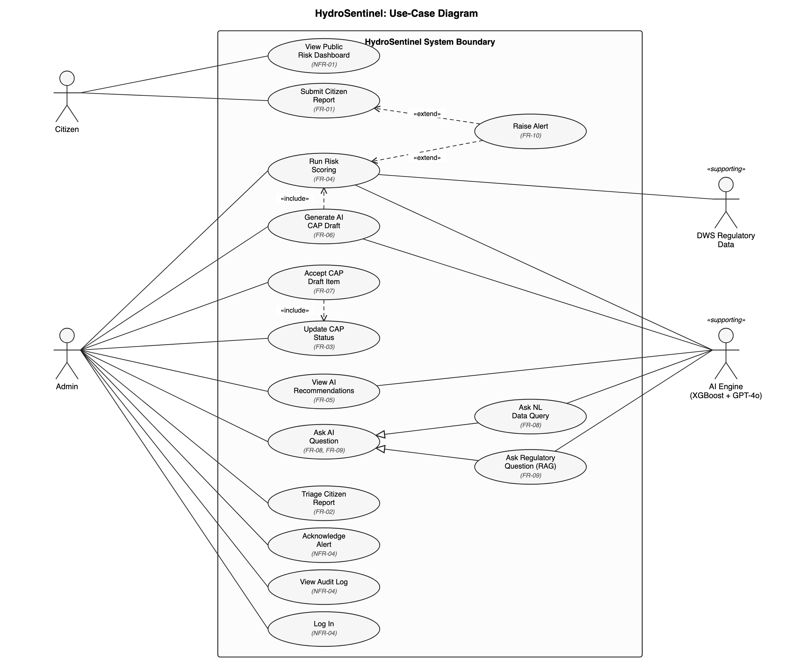
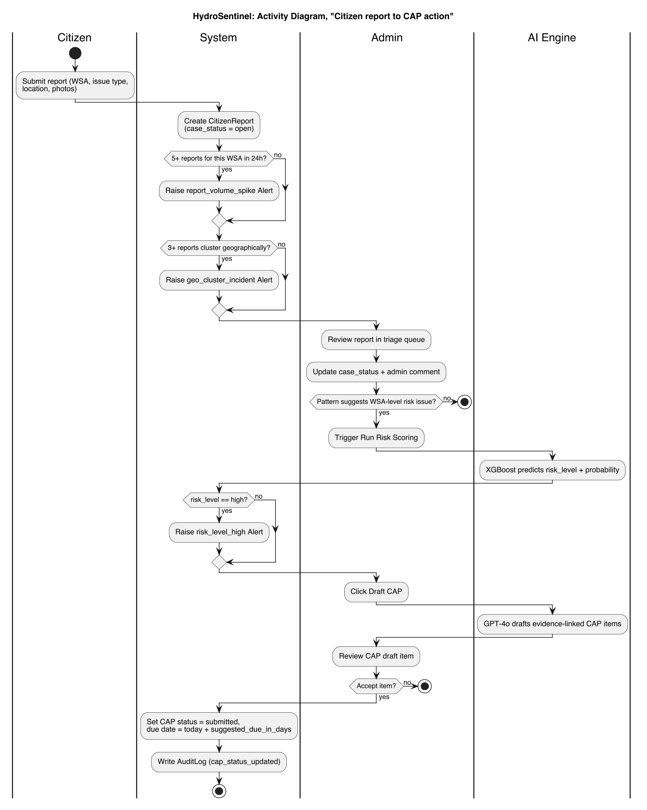
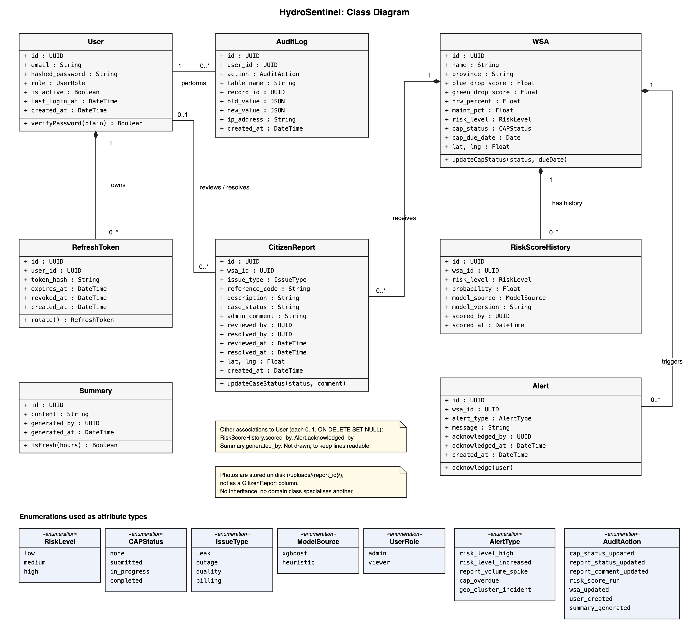
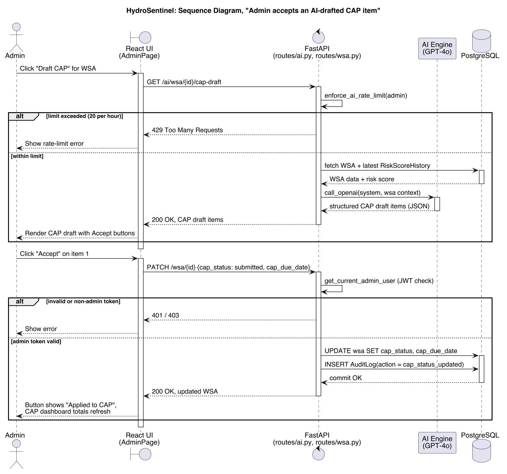

# ISJ107V Assignment 2: Formal System Proposal and Specification

**Project:** HydroSentinel
**Module:** ISJ107V (Integrated Software Project)

---

## Question 1: Project Introduction

### 1.1 Title and description

**Title:** HydroSentinel (AI-Assisted Water Service Risk Monitoring Platform)

HydroSentinel is a web-based monitoring system for South African Water Service Authorities (WSAs). It combines regulatory data (Blue Drop water-quality scores, Green Drop/No Drop wastewater scores, Municipal Money financial data) with citizen-submitted incident reports, and applies machine learning (an XGBoost risk classifier) and a large language model (OpenAI GPT-4o) to score WSA risk, generate corrective-action-plan (CAP) drafts, answer natural-language questions over live data and regulatory documents, and raise early-warning alerts.

Intended users:
- **Municipal/oversight admins:** monitor WSA risk, triage citizen reports, manage CAPs, consult AI recommendations.
- **Citizens:** report water-service issues (leaks, outages, quality, billing) with location and photos.
- **Regulators/DWS-aligned oversight bodies:** view aggregate risk and CAP compliance via the public dashboard.

Emerging technology integrated: **Artificial Intelligence / Machine Learning**. This covers (a) a supervised XGBoost classifier that predicts WSA risk level from structured indicators, and (b) an LLM (GPT-4o) layer providing retrieval-augmented generation (RAG) over regulatory PDFs, a tool-calling natural-language query agent, and generative CAP drafting.

### 1.2 Problem statement

South African WSAs are assessed annually through Blue Drop, Green Drop and No Drop regulatory audits, but the resulting reports are static, siloed PDFs published long after the underlying conditions were measured. Municipal oversight staff must manually cross-reference these PDFs against financial data and ad-hoc citizen complaints to decide where to intervene, with no continuously updated view of risk. Citizens experiencing leaks, outages or water-quality problems have no direct channel to report issues against a specific WSA, and no visibility into whether their issue is being acted on.

The people affected are: municipal water officials and provincial/national DWS oversight staff, who lack a live risk picture and spend disproportionate effort manually reading PDFs; and citizens, who have no reporting channel and no feedback loop. Left unresolved, high-risk WSAs continue to be identified only after the fact (post-audit), corrective action plans go unsubmitted or untracked, and service failures (leaks, outages, contamination) persist longer than necessary because there is no early-warning signal that combines regulatory, financial and on-the-ground citizen data.

### 1.3 Aim, objectives, scope, success criteria

**Aim:** To provide municipal water oversight staff with a continuously updated, AI-assisted view of WSA risk that shortens the time between a service problem occurring and a corrective action being started.

**Objectives:**
1. Automatically compute and display a risk level (low/medium/high) for every WSA using ETL-ingested Blue Drop, No Drop and financial data, refreshed whenever new source data or citizen reports arrive.
2. Give admins an AI-generated, evidence-linked CAP draft they can accept into the CAP tracking workflow in under 2 minutes of review time per WSA.
3. Detect and surface at least three classes of early-warning signal (high risk score, report-volume spike, geographic cluster of reports) automatically, without a manual query.

**Scope boundaries:** In scope: risk scoring, citizen reporting, CAP tracking, AI digests/recommendations/CAP drafting, RAG over regulatory PDFs, an NL query agent, alerting, an admin audit log. Out of scope: payment/billing processing, automated CAP execution (the system tracks and drafts CAPs but does not perform physical remediation work), and SMS/USSD citizen channels (web only for this version).

**Success criteria:**
1. A citizen report submitted for a WSA is reflected in that WSA's admin view and risk-relevant alerts within one page refresh (no manual ETL step required).
2. An admin can go from "AI-drafted CAP" to "CAP status updated and visible on the CAP dashboard" in a single click (the Accept flow), verified by acceptance testing.

---

## Question 2: Requirements Specification

### 2.1 Functional requirements

ID: FR-01  
Priority: Must  
Requirement: The system shall allow a citizen to submit a report against a WSA, selecting an issue type (leak, outage, quality, billing), a description, a map location and optional photos.  
Acceptance criterion: Given a citizen on the report form, when they select a WSA, issue type and location and submit, then a `CitizenReport` row is created with `case_status = open` and is visible in the admin reports table within one refresh.

ID: FR-02  
Priority: Must  
Requirement: The system shall allow an admin to update a citizen report's case status (open/in review/resolved) and attach an admin comment.  
Acceptance criterion: Given an admin viewing an open report, when they change status and save, then the report's `case_status`, `admin_comment`, `reviewed_by`/`reviewed_at` fields update and an audit log entry is written.

ID: FR-03  
Priority: Must  
Requirement: The system shall allow an admin to update a WSA's CAP status (none/submitted/in_progress/completed) and due date.  
Acceptance criterion: Given an admin on a WSA's CAP card, when they change CAP status, then `WSA.cap_status` updates, an `AuditLog` row with action `cap_status_updated` is written, and the CAP dashboard totals update.

ID: FR-04  
Priority: Must  
Requirement: The system shall compute and store a risk level (low/medium/high) and probability for each WSA using the trained XGBoost model, or a deterministic heuristic if no model is loaded.  
Acceptance criterion: Given an admin triggers risk scoring for a WSA, when scoring completes, then a `RiskScoreHistory` row is created and `WSA.risk_level` reflects the new score within the same request.

ID: FR-05  
Priority: Must  
Requirement: The system shall generate an AI-written natural-language risk summary for a selected WSA on request.  
Acceptance criterion: Given a WSA with at least Blue Drop or Green Drop data present, when a user requests the summary, then a non-empty text response referencing that WSA's actual scores is returned within 8 seconds.

ID: FR-06  
Priority: Should  
Requirement: The system shall generate an AI-drafted, prioritised CAP (list of structured action items with a suggested due-in-days) for a WSA on admin request.  
Acceptance criterion: Given an admin clicks "Draft CAP" for a WSA, when generation completes, then at least one CAP draft item with a title, priority and suggested due-in-days is displayed.

ID: FR-07  
Priority: Should  
Requirement: The system shall let an admin accept a single CAP draft item, which applies it to the WSA's live CAP status (status = submitted, due date computed from the suggested days).  
Acceptance criterion: Given a rendered CAP draft, when the admin clicks "Accept" on an item, then `updateWsaCapStatus` is called, the WSA's CAP status becomes `submitted`, and the button changes to "Applied to CAP".

ID: FR-08  
Priority: Should  
Requirement: The system shall let an admin ask a free-text question about live WSA/report/alert/audit data and receive an answer computed from real backend data via tool calls, not from the LLM's own knowledge.  
Acceptance criterion: Given an admin submits a question such as "which Eastern Cape WSAs have no CAP and are high risk", when the query agent resolves it, then the response text only contains values traceable to a tool-function result for that query.

ID: FR-09  
Priority: Should  
Requirement: The system shall let an admin ask a free-text question against the indexed regulatory PDF corpus and receive an answer with the source document referenced.  
Acceptance criterion: Given regulatory PDFs are indexed, when the admin submits a regulations question, then the response cites at least one source PDF filename.

ID: FR-10  
Priority: Could  
Requirement: The system shall automatically raise an alert when a WSA's risk score crosses into "high", when a WSA receives 5+ citizen reports in 24 hours, or when 3+ reports fall within 2 km of each other inside 6 hours.  
Acceptance criterion: Given the qualifying condition occurs, when the triggering event is processed, then an `Alert` row is created with the correct `alert_type` and is visible, unacknowledged, in the admin alerts panel without further action.

### 2.2 Non-functional requirements (FURPS+)

ID: NFR-01  
Category: Performance  
Priority: Must  
Requirement: The system shall return the WSA list and risk map data within 3 seconds under normal load (≤50 concurrent admin users).  
Acceptance criterion: Measured server response time for `GET /wsa` is ≤3 seconds at the 95th percentile.

ID: NFR-02  
Category: Reliability  
Priority: Must  
Requirement: The system shall remain available for AI-independent core functions (report submission, CAP tracking, dashboard) when the OpenAI API is unreachable.  
Acceptance criterion: Given `OPENAI_API_KEY` is unset or the OpenAI call fails, when a user submits a citizen report or updates CAP status, then the action still completes successfully (AI-only endpoints return 503 when the key is missing and 502 when the OpenAI call fails, instead of crashing the app).

ID: NFR-03  
Category: Usability  
Priority: Should  
Requirement: The system shall let a first-time citizen submit a report in 5 fields or fewer without requiring an account.  
Acceptance criterion: A usability walkthrough confirms report submission requires no login and completes in ≤5 form interactions before photo upload.

ID: NFR-04  
Category: Security / Constraint  
Priority: Must  
Requirement: The system shall restrict all CAP-modification, risk-scoring, alert-acknowledgement and audit-log endpoints to authenticated users with the `admin` role.  
Acceptance criterion: Given a request without a valid admin JWT, when it hits a protected endpoint, then the API returns `401`/`403` and no data is modified.

### 2.3 AI/ML-specific testable requirements

ID: AI-NFR-01  
Priority: Must  
Requirement: The XGBoost risk model shall achieve at least 80% classification accuracy on a held-out validation split of labelled WSA risk data.  
Acceptance criterion: The classification report that `ai/train.py` prints for the held-out split shows accuracy ≥0.80 before the model is deployed.

ID: AI-NFR-02  
Priority: Should  
Requirement: The AI query agent shall resolve a natural-language data question in at most 5 OpenAI round-trips and return a result within 15 seconds under normal load.  
Acceptance criterion: Given a representative query set, when run through `run_query_agent`, then the tool-call loop terminates within 5 iterations and total wall-clock time is ≤15 seconds.

ID: AI-NFR-03  
Priority: Must  
Requirement: The AI layer shall enforce a per-admin rate limit of 20 AI requests per rolling hour across the query agent, CAP draft and regulatory-context endpoints, to bound OpenAI API cost and prevent abuse.  
Acceptance criterion: Given an admin has made 20 AI requests within the last 60 minutes, when a 21st request is made, then the API returns `429 Too Many Requests` and no OpenAI call is made.

---

## Question 3: Technical Environment

### 3.1 Technology stack and justification

The interface is built with React 18 and TypeScript, bundled with Vite and styled with Tailwind CSS and shadcn/ui. Vite gives a fast development and build cycle, TypeScript adds type safety for a data-heavy admin interface, and shadcn's accessible, unstyled primitives keep forms, tables and cards consistent without a heavy design system.

Maps use Leaflet through react-leaflet. It is open source, has no API-key or billing dependency (unlike Google Maps), and is sufficient for rendering markers, clusters and circle markers for WSA risk and citizen-report locations.

The backend uses FastAPI (Python). It supports async code, generates OpenAPI documentation automatically, and its native Pydantic validation suits the strict schema checks needed on citizen-submitted and AI-generated data.

PostgreSQL is accessed through SQLAlchemy. Relational integrity suits the relationships between WSAs, reports, CAPs and audit records, JSONB stores the immutable audit-log detail, and PostgreSQL is mature, free and well supported in South African hosting environments.

The AI training dataset is historical Blue Drop, Green Drop/No Drop and Municipal Money data, parsed by the ETL scripts from DWS PDF reports and the Municipal Money API. It is a public regulatory source already used by government oversight bodies, which avoids building a proprietary labelled dataset from scratch.

XGBoost (scikit-learn compatible) classifies risk, OpenAI GPT-4o handles summarisation, CAP drafting, RAG and the natural-language query agent, and scikit-learn TF-IDF supports RAG retrieval. XGBoost handles the small, tabular, mixed-type WSA feature set well and is explainable. GPT-4o is used only for language generation and tool orchestration, never for the underlying risk decision, so the safety-critical scoring stays deterministic and auditable.

The system exposes an internal REST API (FastAPI) and calls the OpenAI REST API outbound only. REST keeps the frontend and backend contract simple and testable, and having no inbound third-party API surface reduces the attack surface.

Authentication uses JWT (python-jose), bcrypt password hashing and refresh-token rotation. Stateless access tokens scale horizontally, and hashed, single-use, rotating refresh tokens limit the damage from a leaked token.

Development uses pytest for the backend (170+ tests), Vitest with jsdom for the frontend, `tsc --noEmit` for type checking, and Docker Compose for local orchestration. The test-first workflow catches regressions before deployment, and Docker Compose gives a reproducible development environment that matches the deployment topology.

The system deploys with Docker Compose (frontend on port 5173, backend on port 8000, plus PostgreSQL), so it is containerised and cloud-agnostic. It can run on any container host, whether a municipal or provincial IT department's own infrastructure or a commercial cloud, without vendor lock-in.

### 3.2 Hardware requirements

For the server processor, the minimum is 2 cores at 2.0 GHz. The recommended specification is 4 cores at 3.0 GHz or higher.

For server memory, the minimum is 4 GB of RAM. The recommended specification is 8 GB, which leaves headroom for XGBoost inference and concurrent OpenAI calls.

For storage, the minimum is 20 GB of SSD for the database, uploaded photos and regulatory PDFs. The recommended specification is 50 GB of SSD with automated growth alerting.

For network and connectivity, the minimum is 10 Mbps with stable outbound HTTPS, which the OpenAI API calls require. The recommended specification is 50 Mbps or more with a low-latency route to OpenAI's API region.

For client devices, the minimum is any device with a modern evergreen browser (Chrome, Safari, Firefox or Edge) and a 1280×720 screen for the admin map view. The recommended setup is a desktop or laptop for admin use and any modern smartphone for citizen reporting, since the camera is used for photo upload.

For specialised hardware, none is required at the minimum level, because the device GPS and camera used for citizen photo and location capture are standard on any modern smartphone. None is recommended either: inference runs server-side, so no on-device ML hardware is needed.

### 3.3 Architecture and deployment

HydroSentinel is a three-tier web architecture: a React SPA (client tier), a FastAPI application server (logic tier) exposing a REST API, and PostgreSQL (data tier). The frontend communicates with the backend exclusively over authenticated HTTPS/JSON (axios, with a request interceptor attaching the JWT and a response interceptor handling silent token refresh). The backend communicates outbound to the OpenAI API for all generative/AI-agent functionality; this call is isolated behind a single `call_openai()` helper so the AI provider can be swapped without touching route logic. ETL scripts run as scheduled/manual batch jobs that parse regulatory PDFs and the Municipal Money API and upsert `WSA` rows directly into PostgreSQL; these writes do not go through the REST API.

**Scalability:** the API layer is stateless (JWT-based auth, no server-side session), so multiple backend containers can run behind a load balancer with Postgres as the single source of truth; the RAG index and XGBoost model are loaded in-process and rebuilt from a cheap directory fingerprint rather than re-parsed on every request, keeping per-instance memory and startup cost low.

**Security:** all admin-mutating endpoints require a valid admin-role JWT (`get_current_admin_user`); refresh tokens are stored SHA-256-hashed and rotate on use; an in-memory sliding-window rate limiter caps AI-endpoint usage per user to prevent cost abuse; all writes to CAP status, risk scores and case status are recorded as immutable `AuditLog` rows.

**Backup and recovery:** PostgreSQL is backed up via scheduled `pg_dump` snapshots (daily, retained 30 days) stored off the application host; uploaded citizen-report photos on disk are included in the same backup cycle; the XGBoost `model.pkl` is versioned outside the database (re-trainable from `ai/train.py` against the ETL dataset) so a corrupted model file degrades to the deterministic heuristic in `predict.py` rather than causing an outage.

---

## Question 4: UML Models

Diagrams 4.2 and 4.4 were drawn in PlantUML; the use-case (4.1) and class (4.3) diagrams were laid out as SVG in strict UML 2 notation so their lines stay uncrossed. All sources are in `docs/diagrams/`. They use the actor, class and component names defined in Questions 1–3 and in the HydroSentinel codebase (`WSA`, `CitizenReport`, `User`, `Alert`, `RiskScoreHistory`, `AuditLog`).

### 4.1 Use-case diagram

*Notes:* `Accept CAP Draft Item` includes `Update CAP Status` because accepting a draft item calls the same CAP-update flow as a manual edit (FR-07). `Generate AI CAP Draft` includes `Run Risk Scoring` because the draft is generated from the WSA's current risk score. `Log In` is a primary Admin use case; every other admin use case requires an authenticated session (NFR-04). `Raise Alert` extends both `Run Risk Scoring` and `Submit Citizen Report` because alert generation happens only when a threshold is met (FR-10). `Ask NL Data Query` and `Ask Regulatory Question (RAG)` specialise the general `Ask AI Question` use case (FR-08, FR-09). `Citizen` and `Admin` are primary actors; `AI Engine` and `DWS Regulatory Data` are supporting actors.

### 4.2 Activity diagram: "Citizen report to CAP action" end-to-end workflow

The emerging-technology steps sit in the **AI Engine** swimlane: XGBoost risk prediction and GPT-4o CAP drafting. The diagram is split into Citizen, System, Admin and AI Engine swimlanes with start/end nodes, decision nodes and both exit paths.

### 4.3 Class diagram

*Notes:* Attribute names and types are taken from the SQLAlchemy models in `backend/app/models.py`; operations are design-level. `WSA` composes `CitizenReport`, `RiskScoreHistory` and `Alert`, and `User` composes `RefreshToken`: the models cascade deletes to these children, so none can outlive its parent. `User` is linked to `AuditLog` (`performs`) and to `CitizenReport` (`reviews / resolves`, via `reviewed_by` and `resolved_by`). The remaining `User` links (`scored_by`, `acknowledged_by`, `generated_by`) are described in the diagram note. Enumerations used as attribute types are listed at the bottom. Photos live on disk, not in a `CitizenReport` column. There is no inheritance because no domain class specialises another. Multiplicities use UML notation (`1`, `0..1`, `0..*`).

### 4.4 Sequence diagram: "Admin accepts an AI-drafted CAP item" (core use case)

---

## Question 5: Implementation and Evaluation

### 5.1 Database/dataset and API

**Database:** PostgreSQL, accessed through SQLAlchemy models (`app/models.py`). Main entities: `WSA` (one row per Water Service Authority, holding regulatory scores, risk level, CAP status), `CitizenReport` (one row per submitted issue, foreign-keyed to `WSA`, optionally reviewed/resolved by a `User`), `User` (admin accounts), `RefreshToken` (hashed, rotating session tokens), `RiskScoreHistory` (append-only log of every risk-scoring run per WSA), `Alert` (system-generated early warnings, foreign-keyed to `WSA`), `AuditLog` (append-only, immutable record of every admin mutation), `Summary` (cached AI-generated digests, reused for 24 hours).

**Training dataset:** historical Blue Drop, Green Drop/No Drop scores and Municipal Money financial indicators, ETL-parsed from published DWS PDF reports and the Municipal Money public API into the `WSA` table; `ai/features.py` derives the feature vector fed to the XGBoost model.

**API:** internal REST API (FastAPI, JSON over HTTPS). Key inputs: `POST /reports` (multipart form: WSA id, issue type, description, lat/lng, photo files), `PATCH /wsa/{id}` (CAP status/due date, admin-only), `POST /ai/query` (free-text question). Key outputs: `GET /wsa`, `GET /alerts`, `GET /ai/wsa/{id}/cap-draft`, all returning Pydantic-validated JSON schemas (`schemas.py`).

**Validation:** every write path is validated by a Pydantic schema before it reaches the ORM (e.g. `CitizenReportCreate` rejects an unrecognised `issue_type` or missing WSA id with a 422 before any DB write); uploaded files are kept only if they have an image extension (.jpg, .jpeg, .png, .webp or .gif), and any other file is skipped.

**Privacy:** citizen reports do not require an account or collect personal contact information beyond what the reporter voluntarily writes in the free-text description; uploaded photos are served from a non-guessable per-report path (`/uploads/{report_id}/{file}`) rather than being publicly listable; only authenticated admins can read the case-management fields (`admin_comment`, `reviewed_by`) via the protected `GET /reports` endpoint.

### 5.2 Emerging-technology integration

The AI component sits at three points in the software workflow.

First, risk scoring. When an admin requests a score for a WSA, the backend passes the WSA record to the risk prediction function. That function turns the WSA's indicators (Blue Drop score, Green Drop score, non-revenue water, maintenance spending and similar) into a feature row and asks the trained XGBoost classifier for a probability for each risk level. The highest-probability level becomes the result. The output feeds straight back into the workflow: the WSA's risk level is updated, a history record is stored, and a high result can raise an alert.

Second, generative assistance. CAP drafts, digests and recommendations are produced by GPT-4o. Every call goes through one helper function, so the AI provider is a single replaceable seam and the rate limiter and error handling sit in one place. The model only writes text; it never decides a risk level.

Third, tool-augmented questions. The natural-language query agent lets GPT-4o call a fixed set of backend functions (list WSAs, count reports, list alerts, summarise the audit log, compare provinces). Each function runs a real database query, and GPT-4o phrases the returned data. This stops it inventing figures. The loop stops after at most five model round-trips.

Interface contract for the risk-scoring integration point, written as numbered steps:

1. Input: the identifier of one WSA, sent by an authenticated admin. If no WSA has that identifier, the operation stops and returns a "not found" error.
2. Model choice: if a trained model is loaded, the WSA has a Blue Drop score, and the model's top probability reaches the minimum confidence level, the XGBoost result is used and marked as source "xgboost". In every other case (no model file, missing Blue Drop score, or low confidence) the deterministic rule-based heuristic is used instead and marked as source "heuristic". This is why scoring never fails when the model is unavailable.
3. Output: a risk level (low, medium or high), a probability between 0 and 1, and the source of the result.
4. Effects, saved together in one database transaction: the WSA's current risk level is updated; a new risk score history record is added with the level, probability, source, model version, scorer and time; and an audit log entry records the change.
5. Follow-on rule: if the level is high, a "risk level high" alert is raised unless an equivalent alert is already open, so repeated scoring does not flood the admin with duplicates.
6. Guarantee: the operation always returns a result for a valid WSA. Only steps 2 to 5 differ between the model path and the fallback path, so the rest of the system handles both in the same way.

### 5.3 Testing and evaluation plan

**Functional testing:** backend REST endpoints are covered by an automated pytest suite (170+ tests) run against a transactional test database (each test wrapped in a rolled-back transaction); the frontend uses Vitest/jsdom for pure logic (WSA selection ranking, date-range filtering, data-completeness scoring) and `tsc --noEmit` as a type-correctness gate before every commit.

**Emerging-technology metric:** XGBoost risk-classification accuracy on a held-out validation split (target ≥80%, per AI-NFR-01), tracked each time `ai/train.py` is re-run against refreshed ETL data, with the trained model's accuracy logged alongside `model.pkl` so a regression is visible before deployment.

**User acceptance testing:** admin users perform a scripted walkthrough: submit a citizen report, confirm it appears in triage, trigger risk scoring, draft and accept a CAP item, ask one NL data question and one regulatory-document question, then confirm each step completes without a manual page reload or console error, matching FR-01 through FR-09.

**Key technical risk and mitigation:** the system depends on the OpenAI API for all generative capabilities (digests, CAP drafts, the query agent, RAG answers); an outage or rate-limit event on that third-party dependency could degrade the AI-assisted parts of the admin experience. Mitigation: every OpenAI call is isolated behind `call_openai()` with try/except handling that returns a graceful `503` rather than a crash, core non-AI functionality (reporting, CAP tracking, alerts, the risk map) has no runtime dependency on OpenAI, and a per-admin rate limiter (AI-NFR-03) caps request volume so a client-side bug or misuse cannot generate runaway API cost.
