# ISJ107V Assignment 3: Project Documentation and UML Design

**Project:** HydroSentinel (prototype build)
**Module:** ISJ107V (Integrated Software Project)
**Continues:** Assignment 2, Formal System Proposal and Specification (same project, same emerging technology, same requirement IDs)

---

## Question 1: Project Baseline

### 1.1 Title, purpose, users, technology and executive summary

**Title:** HydroSentinel, an AI-assisted water service risk monitoring platform for South African Water Service Authorities (WSAs).

**Purpose.** HydroSentinel gives municipal and oversight staff one live view of which water service authorities are at risk, what corrective action is under way, and what residents are reporting on the ground. It replaces the current routine of reading annual Department of Water and Sanitation (DWS) PDF reports and cross-checking them by hand.

**Intended users.** There are three groups. Citizens use the public dashboard and the report page to log leaks, outages, quality and billing problems without creating an account. Municipal and oversight administrators sign in to triage reports, set corrective action plan (CAP) status, run risk scoring and use the AI tools. Regulators and DWS-aligned oversight bodies read the public dashboard.

**Selected emerging technology.** Artificial intelligence and machine learning, unchanged from Assignment 2. A supervised XGBoost classifier predicts a WSA's risk level. OpenAI GPT-4o drafts CAPs, writes summaries and digests, answers questions in natural language through a fixed set of database tools, and answers questions about the regulatory PDFs through a TF-IDF retrieval index.

**Executive summary of the implemented solution.** The prototype is a working three-tier web application. A React 18 and TypeScript single-page app (four pages) talks over REST and JSON to a FastAPI server that exposes 36 endpoints. The server stores data in eight PostgreSQL tables and currently holds 284 WSAs, built by an ETL pipeline from five distinct public DWS PDF reports and the National Treasury Municipal Money API. The AI component scores risk with XGBoost (falling back to a rule-based heuristic), drafts structured CAPs that an admin can accept in one click, answers data questions in about two to three seconds, and is rate limited to 20 requests per admin per hour. Every change an admin makes is written to an immutable audit log. The backend has 173 automated tests and the frontend has 13, and all pass. This document describes the system as it stands at the prototype stage, before the planned prototype presentation and the later final product.

### 1.2 Final aim, objectives, scope and changes since Assignment 2

**Aim.** To give municipal water oversight staff a continuously updated, AI-assisted view of WSA risk that shortens the time between a service problem occurring and a corrective action being started.

**Measurable objectives, with their status at the prototype stage.**

1. Automatically compute and display a risk level (low, medium or high) for every WSA, refreshed when new source data or citizen reports arrive. Status: partly met. All 284 WSAs carry a risk level and 568 scoring events are stored, but re-scoring is a manual step. An admin runs `backend/scripts/bulk_risk_score.py` or calls the scoring endpoint, and nothing re-scores automatically when new data or a report arrives. There is also no scoring button in the admin page. In addition, 70% of stored scores (400 of 568) came from the rule-based fallback, because 116 WSAs have no Blue Drop score. Section 5.4 discusses both points.
2. Give admins an AI-generated, evidence-linked CAP draft they can accept in under two minutes of review time per WSA. Status: met on system time, not yet tested with real users. A draft takes 2.5 to 3.3 seconds to generate (three live runs), and accepting an item is one click. Review time by real administrators has not been measured.
3. Detect and surface at least three classes of early-warning signal without a manual query. Status: met, and exceeded. The system raises five alert types: high risk score, risk level increased, report volume spike, overdue CAP and geographic cluster of reports.

**Scope.** In scope: risk scoring, citizen reporting and case tracking, CAP tracking, AI digests, recommendations and CAP drafting, retrieval over regulatory PDFs, a natural-language query agent, alerting and an admin audit log. Out of scope: payment or billing processing, automated execution of a CAP (the system tracks and drafts but does not carry out remediation), and SMS or USSD citizen channels.

**Approved changes since Assignment 2.** The lecturer approved no change to the project or the emerging technology, so both are as proposed in Assignment 2. Two kinds of edit were made, and neither needed approval, but both are recorded here so the documents stay honest.

The first kind is corrections to requirement wording, made after checking the proposal against the implemented code. FR-01 said up to five photos, but the code accepts any number of photos with an image file extension, so the requirement now says optional photos. FR-10 said a fixed radius and time window, and the code uses three or more reports within 2 km inside 6 hours, so the requirement now states that. The acceptance criterion for AI-NFR-01 said the training script reports accuracy, but the script prints a classification report and does not enforce a threshold, so the wording now matches. NFR-02 said an OpenAI failure returns 503, but the code returns 503 when the key is missing and 502 when the call fails, so both are stated. Each correction moves the text toward what was built, and none lowers a target.

The second kind is additions built beyond the Assignment 2 list, all inside the same aim: risk trajectory forecasting (the "trending toward higher risk" panel), CSV export of WSAs and reports, admin user management, public report tracking by reference code, overdue-CAP alerts, a per-admin AI rate limiter and an explicit 30 second timeout on every OpenAI call. The timeout was added during this evaluation, after testing showed the library default of 600 seconds would let an OpenAI outage hold a request for far too long.

### 1.3 Document control

**Document title:** ISJ107V Assignment 3, HydroSentinel project documentation and UML design.
**Version:** 1.0 (prototype baseline).
**Date:** 19 September 2026.
**Author:** Malo.
**Status:** submitted for assessment, individual work.

**Revision history.**
- Version 0.1, 16 September 2026: Assignment 2 proposal and specification, first complete draft with four UML diagrams.
- Version 0.2, 19 September 2026: Assignment 2 diagrams redrawn in strict UML 2 notation, requirement wording corrected to match the implementation (section 1.2).
- Version 1.0, 19 September 2026: this document, written after the full test run, live measurements and model evaluation described in Question 5.

**Glossary.**
- WSA: Water Service Authority, a municipality or water board responsible for supplying water.
- DWS: the South African Department of Water and Sanitation, which audits WSAs.
- Blue Drop: the DWS drinking-water quality programme. A WSA receives a Blue Drop score from 0 to 100.
- Green Drop: the DWS wastewater programme, scored the same way.
- No Drop: the DWS programme on water losses and water conservation.
- NRW: non-revenue water, water lost before it is billed. Lower is better.
- BDRR: Blue Drop Risk Rating, a risk percentage that DWS auditors calculate for each WSA from five risk indicators. It is the ground-truth label the model is trained on.
- CAP: corrective action plan, the set of actions a WSA commits to so that it fixes the problems found in an audit.
- Risk level: low, medium or high, set by the XGBoost model or by the fallback heuristic.
- XGBoost: a gradient-boosted decision tree library used here as a three-class classifier.
- LLM and GPT-4o: large language model, and the specific OpenAI model used.
- RAG: retrieval-augmented generation, meaning the answer is built from passages retrieved from documents.
- TF-IDF: a text-weighting method used to rank which PDF passages match a question.
- ETL: extract, transform, load, the batch scripts that read the source data into the database.
- JWT: JSON Web Token, the signed token that proves an admin is signed in.
- API: application programming interface, here the REST endpoints the frontend calls.
- UML: Unified Modeling Language.

**Referenced project artefacts.**
- Source repository: local Git repository on the main branch, mirrored at github.com/Malodeity/hydrosentinel.
- Backend: `backend/` (FastAPI application in `backend/app/`, AI code in `backend/ai/`, ETL scripts in `backend/etl/`, tests in `backend/tests/`).
- Frontend: `frontend/src/` (pages, components, API client, library helpers and Vitest tests).
- Deployment definition: `docker-compose.yml` and `.env.example` in the repository root.
- Assignment 2 document: `docs/ISJ107V_Assignment2_HydroSentinel.md`, with diagram sources in `docs/diagrams/`.
- Assignment 3 diagrams and screenshots: `docs/a3-diagrams/` and `docs/a3-screens/`.
- Model evaluation script: `backend/ai/train_from_bdrr.py`. Raw source data: `backend/data/raw/` (six PDF files, five distinct DWS reports).
- Evidence for Question 5: `docs/a3-evidence/` holds the full pytest and Vitest output, the four measurement scripts with their recorded output, and the model evaluation output described in sections 5.1 and 5.2.

---

## Question 2: Requirements and Traceability

### 2.1 Final prioritised requirements

The requirements are carried over from Assignment 2 with the wording corrections listed in section 1.2. Each has a unique identifier, a priority and a measurable acceptance criterion. Functional requirements come first, then the non-functional requirements grouped by FURPS+ category, then the three requirements specific to the AI technology.

#### Functional requirements

ID: FR-01  
Priority: Must  
Requirement: The system shall allow a citizen to submit a report against a WSA, selecting an issue type (leak, outage, quality, billing), a description, a map location and optional photos.  
Acceptance criterion: Given a citizen on the report form, when they select a WSA, issue type and location and submit, then a `CitizenReport` row is created with `case_status = open` and is visible in the admin reports table within one refresh.

ID: FR-02  
Priority: Must  
Requirement: The system shall allow an admin to update a citizen report's case status (open/in review/resolved) and attach an admin comment.  
Acceptance criterion: Given an admin viewing an open report, when they change status and save, then the report's `case_status`, `admin_comment`, `reviewed_by`/`reviewed_at` fields update and an audit log entry is written.

ID: FR-03  
Priority: Must  
Requirement: The system shall allow an admin to update a WSA's CAP status (none/submitted/in_progress/completed) and due date.  
Acceptance criterion: Given an admin on a WSA's CAP card, when they change CAP status, then `WSA.cap_status` updates, an `AuditLog` row with action `cap_status_updated` is written, and the CAP dashboard totals update.

ID: FR-04  
Priority: Must  
Requirement: The system shall compute and store a risk level (low/medium/high) and probability for each WSA using the trained XGBoost model, or a deterministic heuristic if no model is loaded.  
Acceptance criterion: Given an admin triggers risk scoring for a WSA, when scoring completes, then a `RiskScoreHistory` row is created and `WSA.risk_level` reflects the new score within the same request.

ID: FR-05  
Priority: Must  
Requirement: The system shall generate an AI-written natural-language risk summary for a selected WSA on request.  
Acceptance criterion: Given a WSA with at least Blue Drop or Green Drop data present, when a user requests the summary, then a non-empty text response referencing that WSA's actual scores is returned within 8 seconds.

ID: FR-06  
Priority: Should  
Requirement: The system shall generate an AI-drafted, prioritised CAP (list of structured action items with a suggested due-in-days) for a WSA on admin request.  
Acceptance criterion: Given an admin clicks "Draft CAP" for a WSA, when generation completes, then at least one CAP draft item with a title, priority and suggested due-in-days is displayed.

ID: FR-07  
Priority: Should  
Requirement: The system shall let an admin accept a single CAP draft item, which applies it to the WSA's live CAP status (status = submitted, due date computed from the suggested days).  
Acceptance criterion: Given a rendered CAP draft, when the admin clicks "Accept" on an item, then `updateWsaCapStatus` is called, the WSA's CAP status becomes `submitted`, and the button changes to "Applied to CAP".

ID: FR-08  
Priority: Should  
Requirement: The system shall let an admin ask a free-text question about live WSA/report/alert/audit data and receive an answer computed from real backend data via tool calls, not from the LLM's own knowledge.  
Acceptance criterion: Given an admin submits a question such as "which Eastern Cape WSAs have no CAP and are high risk", when the query agent resolves it, then the response text only contains values traceable to a tool-function result for that query.

ID: FR-09  
Priority: Should  
Requirement: The system shall let an admin ask a free-text question against the indexed regulatory PDF corpus and receive an answer with the source document referenced.  
Acceptance criterion: Given regulatory PDFs are indexed, when the admin submits a regulations question, then the response cites at least one source PDF filename.

ID: FR-10  
Priority: Could  
Requirement: The system shall automatically raise an alert when a WSA's risk score crosses into "high", when a WSA receives 5+ citizen reports in 24 hours, or when 3+ reports fall within 2 km of each other inside 6 hours.  
Acceptance criterion: Given the qualifying condition occurs, when the triggering event is processed, then an `Alert` row is created with the correct `alert_type` and is visible, unacknowledged, in the admin alerts panel without further action.

#### Non-functional requirements (FURPS+)

ID: NFR-01  
Category: Performance  
Priority: Must  
Requirement: The system shall return the WSA list and risk map data within 3 seconds under normal load (≤50 concurrent admin users).  
Acceptance criterion: Measured server response time for `GET /wsa` is ≤3 seconds at the 95th percentile.

ID: NFR-02  
Category: Reliability  
Priority: Must  
Requirement: The system shall remain available for AI-independent core functions (report submission, CAP tracking, dashboard) when the OpenAI API is unreachable.  
Acceptance criterion: Given `OPENAI_API_KEY` is unset or the OpenAI call fails, when a user submits a citizen report or updates CAP status, then the action still completes successfully (AI-only endpoints return 503 when the key is missing and 502 when the OpenAI call fails, instead of crashing the app).

ID: NFR-03  
Category: Usability  
Priority: Should  
Requirement: The system shall let a first-time citizen submit a report in 5 fields or fewer without requiring an account.  
Acceptance criterion: A usability walkthrough confirms report submission requires no login and completes in ≤5 form interactions before photo upload.

ID: NFR-04  
Category: Security / Constraint  
Priority: Must  
Requirement: The system shall restrict all CAP-modification, risk-scoring, alert-acknowledgement and audit-log endpoints to authenticated users with the `admin` role.  
Acceptance criterion: Given a request without a valid admin JWT, when it hits a protected endpoint, then the API returns `401`/`403` and no data is modified.

#### AI and machine learning requirements

ID: AI-NFR-01  
Priority: Must  
Requirement: The XGBoost risk model shall achieve at least 80% classification accuracy on a held-out validation split of labelled WSA risk data.  
Acceptance criterion: The classification report that `ai/train.py` prints for the held-out split shows accuracy ≥0.80 before the model is deployed.

ID: AI-NFR-02  
Priority: Should  
Requirement: The AI query agent shall resolve a natural-language data question in at most 5 OpenAI round-trips and return a result within 15 seconds under normal load.  
Acceptance criterion: Given a representative query set, when run through `run_query_agent`, then the tool-call loop terminates within 5 iterations and total wall-clock time is ≤15 seconds.

ID: AI-NFR-03  
Priority: Must  
Requirement: The AI layer shall enforce a per-admin rate limit of 20 AI requests per rolling hour across the query agent, CAP draft and regulatory-context endpoints, to bound OpenAI API cost and prevent abuse.  
Acceptance criterion: Given an admin has made 20 AI requests within the last 60 minutes, when a 21st request is made, then the API returns `429 Too Many Requests` and no OpenAI call is made.

---

### 2.2 Requirements traceability matrix

Each entry links one requirement to its UML element, implementation module, test case and completion status. Test case identifiers are defined in section 5.1. Status is Pass, Partial or Not met, judged against the acceptance criterion in section 2.1. "Automated" means the test runs in the pytest or Vitest suites. "Live" means it was run by hand against the running system on 19 September 2026 with the measurement scripts described in Question 5.

Requirement: FR-01  
UML reference: use case Submit Citizen Report, class CitizenReport, activity diagram in section 3.5  
Module: `backend/app/routes/reports.py`, `frontend/src/components/ReportForm.tsx`  
Test case: TC-I1 (automated, `tests/test_report_tracking.py`, 6 tests)  
Status: Pass

Requirement: FR-02  
UML reference: use case Triage Citizen Report, class CitizenReport (updateCaseStatus)  
Module: `backend/app/routes/reports.py`, `backend/app/audit_helpers.py`  
Test case: TC-I2 (automated, `tests/test_report_traceability.py`, 5 tests, plus the report-status test in `tests/test_audit_log.py`)  
Status: Pass

Requirement: FR-03  
UML reference: use case Update CAP Status, class WSA (updateCapStatus)  
Module: `backend/app/routes/wsa.py`, `frontend/src/pages/AdminPage.tsx`  
Test case: TC-I3 (automated, CAP change writes an audit entry in `tests/test_audit_log.py`, due date in `tests/test_cap_overdue.py`)  
Status: Pass

Requirement: FR-04  
UML reference: use case Run Risk Scoring, classes WSA and RiskScoreHistory  
Module: `backend/app/routes/risk.py`, `backend/ai/predict.py`  
Test case: TC-U1 and TC-I4 (automated, `tests/test_predict.py` 6 tests and `tests/test_risk_history.py` 7 tests)  
Status: Pass for the scoring endpoint. The acceptance criterion says an admin triggers scoring, and today that happens through the API or `scripts/bulk_risk_score.py`, since the admin page has no scoring button. Automatic re-scoring on new data is not built.

Requirement: FR-05  
UML reference: use case View AI Recommendations, AI Engine actor  
Module: `backend/app/routes/ai.py` (summary endpoint)  
Test case: ST-04 (live, no automated test)  
Status: Pass. Three WSAs answered in 1.6 to 2.1 seconds and each summary quoted the WSA's real Blue Drop score. The missing automated test is a gap.

Requirement: FR-06  
UML reference: use case Generate AI CAP Draft, sequence diagram in section 3.4  
Module: `backend/app/routes/ai.py` (`get_cap_draft`, `parse_cap_draft_json`)  
Test case: TC-U2 and TC-I5 (automated, `tests/test_cap_draft.py`, 11 tests) and ST-05 (live)  
Status: Pass

Requirement: FR-07  
UML reference: use case Accept CAP Draft Item, sequence diagram in section 3.4  
Module: `frontend/src/pages/AdminPage.tsx` (Accept button), `backend/app/routes/wsa.py`  
Test case: UAT-02 (live, manual walkthrough in the browser)  
Status: Pass. There is no automated frontend test for the button, so a regression would not be caught automatically.

Requirement: FR-08  
UML reference: use case Ask NL Data Query, AI Engine actor  
Module: `backend/ai/query_agent.py`, `backend/app/routes/ai.py` (`POST /ai/query`)  
Test case: TC-I6 (automated, `tests/test_query_agent.py`, 14 tests) and ST-06 (live)  
Status: Pass

Requirement: FR-09  
UML reference: use case Ask Regulatory Question (RAG), AI Engine actor  
Module: `backend/ai/rag.py`, `backend/app/routes/ai.py` (`/regulatory-context`)  
Test case: TC-I7 (automated, `tests/test_rag.py`, 14 tests, including a cited-answer test)  
Status: Pass

Requirement: FR-10  
UML reference: use case Raise Alert, class Alert, alert types in the class diagram  
Module: `backend/app/alert_helpers.py`  
Test case: TC-I8 (automated, `tests/test_alerts.py` 10 tests, `tests/test_geo_cluster_alert.py` 8 tests, `tests/test_cap_overdue.py` 6 tests)  
Status: Pass. The volume-spike test was added during this evaluation, because that path had no test before.

Requirement: NFR-01  
UML reference: deployment diagram and architecture diagram (API layer)  
Module: `backend/app/routes/wsa.py`  
Test case: ST-01 (live measurement, 100 sequential and 200 concurrent requests)  
Status: Pass. 95th percentile 9 ms sequential and 474 ms with 50 concurrent users, against a 3 second target.

Requirement: NFR-02  
UML reference: component diagram (AI component isolated behind one helper), activity diagram exceptions  
Module: `backend/app/routes/ai.py` (`get_openai_client`, `call_openai`)  
Test case: ST-02 (live, second server started with a blank OpenAI key)  
Status: Pass. AI endpoints returned 503 in about 2 to 3 ms and every core endpoint still returned 200.

Requirement: NFR-03  
UML reference: use case Submit Citizen Report  
Module: `frontend/src/components/ReportForm.tsx`  
Test case: IN-01 (inspection of the form and its submit rule)  
Status: Pass by inspection. Only province, WSA and a description of at least 10 characters are required, and no account is needed. It has not been tested with real citizens.

Requirement: NFR-04  
UML reference: use case Log In, sequence diagram (JWT check)  
Module: `backend/app/auth.py` (`get_current_admin_user`)  
Test case: TC-I9 (automated, `tests/test_auth.py` 8 tests, admin-only checks in `tests/test_alerts.py`, `tests/test_audit_log.py` and `tests/test_user_management.py`) and ST-03 (live)  
Status: Pass. Six protected endpoints called without a token all returned 401.

Requirement: AI-NFR-01  
UML reference: AI component in the architecture and component diagrams  
Module: `backend/ai/train_from_bdrr.py`, `backend/ai/train.py`  
Test case: AT-01 (live model evaluation against DWS BDRR labels)  
Status: Partial. Accuracy is 89.7% on the single held-out split but 77.8% (standard deviation 8.8%) under five-fold cross-validation, which is the more reliable figure and is below the 80% target. Section 2.3 explains.

Requirement: AI-NFR-02  
UML reference: sequence diagram for the query agent tool loop, use case Ask NL Data Query  
Module: `backend/ai/query_agent.py` (`run_query_agent`, at most 5 rounds)  
Test case: AT-02 (live, three real questions) and TC-I6 (automated, includes the five-round stop)  
Status: Pass. Answers took 1.8 to 3.4 seconds using one tool call each.

Requirement: AI-NFR-03  
UML reference: component diagram (Rate Limiter), activity diagram (429 path)  
Module: `backend/app/rate_limit.py`  
Test case: TC-I10 (automated, `tests/test_ai_rate_limit.py`, 6 tests)  
Status: Pass. The limiter keeps its counts in the memory of one server process, which section 5.4 lists as a limitation.

Summary of status: 16 requirements Pass, 1 Partial (AI-NFR-01), 0 Not met.

### 2.3 How the implemented system meets the three AI requirements

**AI-NFR-01, model accuracy of at least 80% on held-out data.** The model is an XGBoost classifier with three classes (low, medium, high). The training and evaluation script `backend/ai/train_from_bdrr.py` trains on 144 WSAs that carry a DWS-audited BDRR label and evaluates two ways. On a single stratified 80/20 split (115 training rows, 29 test rows) the model scores 89.7% accuracy, against 34.5% for the rule-based heuristic on the same rows. On five-fold stratified cross-validation the folds score 86.2%, 65.5%, 69.0%, 82.8% and 85.7%, a mean of 77.8% with a standard deviation of 8.8%. With only 29 test rows, one split is noisy, so the cross-validation mean is the number to trust, and it sits just under the 80% target. The requirement is therefore Partial. The weak class is medium risk: on the held-out split its recall is 0.57, meaning it found four of the seven medium WSAs, and all three misses were called low. Retraining on more data is planned for after the prototype (section 5.4).

**AI-NFR-02, at most five OpenAI round-trips and 15 seconds per data question.** The query agent runs a loop in which GPT-4o may call one of five whitelisted database tools (list WSAs, count reports, list alerts, summarise the audit log, compare provinces). The loop is capped at five rounds in code, and a test confirms it stops there. Three real questions were timed against the running server with the live OpenAI key. They returned in 3.43, 1.77 and 2.25 seconds, and each used one tool call. The requirement is met with wide margin.

**AI-NFR-03, at most 20 AI requests per admin per hour.** A dependency on the query, CAP-draft and regulatory-context endpoints counts each admin's calls in a sliding one-hour window and returns 429 from the twenty-first. Six automated tests cover allowing calls under the limit, blocking over it, keeping users separate, expiring old calls, the 429 response through the API, and the 30 second OpenAI timeout added during this evaluation. The requirement is met, with the caveat that the count lives in one process's memory.

---

## Question 3: Final Design as Implemented

Names are used the same way in every diagram and in the text: actors Citizen, Admin, AI Engine and DWS Regulatory Data; classes WSA, CitizenReport, RiskScoreHistory, Alert, User, RefreshToken, AuditLog and Summary; and the use case names shown in Figure 2. The diagrams were drawn in PlantUML, or laid out as SVG in strict UML 2 notation where the automatic layout produced crossing lines, and every source file is in `docs/diagrams/` or `docs/a3-diagrams/`.

### 3.1 High-level system architecture

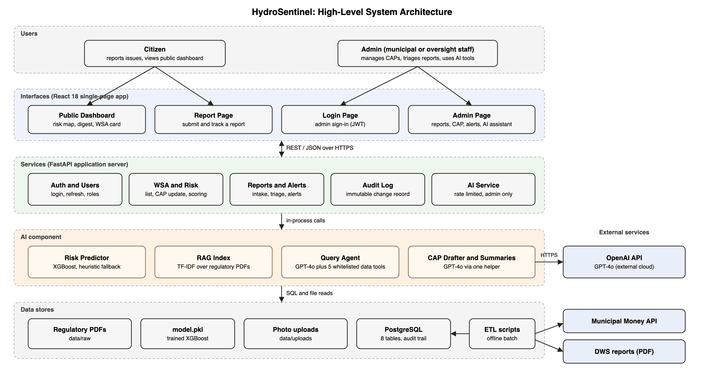

Figure 1 shows the system in layers. Citizens and Admins reach the React single-page app through four pages: the public dashboard, the report page, the login page and the admin page. The app calls the FastAPI server over REST and JSON. Admin calls carry a JWT, and the citizen endpoints (submit a report, track a report, read WSAs) do not need one. The server groups its endpoints into authentication and users, WSA and risk scoring, reports and alerts, the audit log, and the AI service.

The AI component sits behind the AI service and the risk endpoint. It has four parts: the risk predictor (XGBoost with a heuristic fallback), the retrieval index over the regulatory PDFs, the query agent, and the CAP drafter and summary writer. The query agent and the drafter reach the only external AI dependency, the OpenAI API, and they do so through one helper function. The data stores are PostgreSQL, the photo uploads folder, the regulatory PDFs and the trained `model.pkl`. A separate offline ETL step reads the DWS reports and the Municipal Money API into PostgreSQL. Nothing external calls in to the system.

### 3.2 Use-case diagram and a detailed use-case description

Figure 2 is the Assignment 2 use-case diagram, checked against the implementation and left unchanged, because every use case in it exists in the running system. Each use case carries the requirement it realises. `Accept CAP Draft Item` includes `Update CAP Status`, `Generate AI CAP Draft` includes `Run Risk Scoring` (the draft depends on a stored score, and scoring itself is run through the API or the bulk script, not from a button), `Raise Alert` extends both `Submit Citizen Report` and `Run Risk Scoring`, and the two AI question use cases specialise `Ask AI Question`.

**Detailed use-case description: Generate and Accept an AI CAP Draft** (realises FR-06 and FR-07).

Use case name: Generate and Accept an AI CAP Draft.  
Primary actor: Admin. Supporting actor: AI Engine.  
Goal: turn a WSA's data into a reviewed corrective action plan item that is recorded against the WSA.  
Preconditions: the Admin is signed in with the admin role, the WSA exists, and an OpenAI key is configured on the server.  
Trigger: the Admin selects a WSA on the admin page and clicks Draft CAP.

Normal flow:
1. The system checks the Admin's token and the admin role.
2. The system checks that the Admin has made fewer than 20 AI requests in the last hour.
3. The system loads the WSA's indicators, its latest risk score and the counts of its open reports by issue type.
4. The system asks GPT-4o for three to five CAP items in a fixed JSON shape, each with an action, a priority, a suggested due date in days and a justification that must quote a number from the data.
5. The system validates the reply, replaces any invalid priority with medium, drops any item without an action and keeps at most six items.
6. The system shows the items, each with an Accept button.
7. The Admin reviews an item and clicks Accept.
8. The system sets the WSA's CAP status to submitted and its due date to today plus the suggested days, and writes an audit log entry recording who did it.
9. The system shows "Applied to CAP" on that item and refreshes the CAP totals.

Alternative flows:
- A1, not authorised (step 1): the token is missing, expired or not an admin token. The system returns 401 or 403 and the Admin is sent to sign in again.
- A2, rate limit reached (step 2): the system returns 429 with the message that the hourly limit is reached and no OpenAI call is made.
- A3, WSA not found (step 3): the system returns 404.
- A4, AI not configured (step 4): the server has no OpenAI key, so the system returns 503. Everything that does not use AI keeps working.
- A5, AI call fails or the reply is unusable (steps 4 and 5): the OpenAI call fails, times out after 30 seconds, or the reply contains no valid item. The system returns 502 (the detail message is "Could not generate a structured CAP draft" when no valid item comes back), and the Admin can try again.
- A6, Admin declines (step 7): the Admin does not accept any item, so the CAP stays unchanged and nothing is written.
- A7, save fails (step 8): the update request fails, the page shows "Could not apply this CAP item", and the item stays available to accept again.

Postconditions: on success the WSA has CAP status submitted, a due date, and an audit entry. On any alternative flow the WSA is unchanged.  
Business rules: an AI draft never changes a CAP by itself; only an Admin's explicit Accept does. The model may only cite numbers supplied in the prompt. The risk score the draft reads is the last one stored, so it is only as fresh as the last scoring run.

### 3.3 Class diagram

Figure 3 shows the eight domain classes with the attribute names and types taken from the SQLAlchemy models in `backend/app/models.py`. `WSA` composes `CitizenReport`, `RiskScoreHistory` and `Alert`, and `User` composes `RefreshToken`, because the models cascade deletes to these children. `User` also links to `AuditLog` and, through `reviewed_by` and `resolved_by`, to `CitizenReport`. Multiplicities are shown on every association, and the enumerations used as attribute types are listed under the diagram.

The operations in the diagram (`updateCapStatus`, `updateCaseStatus`, `acknowledge`, `verifyPassword`, `rotate`, `isFresh`) are implemented as functions and route handlers, not as methods on the model classes. For example `verifyPassword` is `verify_password` in `backend/app/auth.py`, `updateCapStatus` is the `PATCH /wsa/{id}` handler, and `acknowledge` is the `PATCH /alerts/{id}/acknowledge` handler. This keeps the models as plain data mappings and puts the rules next to the endpoint that enforces them.

### 3.4 Sequence diagram

Figure 4 follows the core transaction from section 3.2. The Admin clicks Draft CAP in the React page (interface). The FastAPI route (control) first runs the rate limiter, then reads the WSA and its latest risk score from PostgreSQL (data), then calls GPT-4o (emerging technology) through the OpenAI helper and returns the structured items. When the Admin accepts an item, the page sends a PATCH request. The route checks the admin token, updates the WSA, inserts the audit entry in the same commit and returns the updated WSA. The two `alt` boxes show the failure branches: 429 for the rate limit, and 401 or 403 for a bad token.

### 3.5 Activity diagram

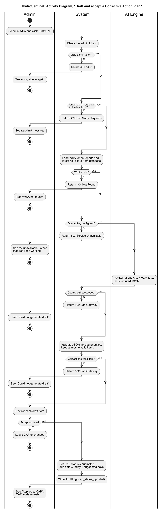

Figure 5 models the same workflow end to end, with three swimlanes (Admin, System, AI Engine) and every exit the code can take. There is one start node. There are seven decision nodes: valid admin token, under the hourly limit, WSA exists, OpenAI key configured, OpenAI call succeeded, at least one valid item, and whether the Admin accepts an item. The exceptions each end in a labelled final node after the Admin sees a message: 401 or 403, 429, 404, 503 and 502. There are two ways to finish without a change: the Admin declines, or an error stops the flow. The single success ending is "Applied to CAP".

### 3.6 Component and deployment diagrams

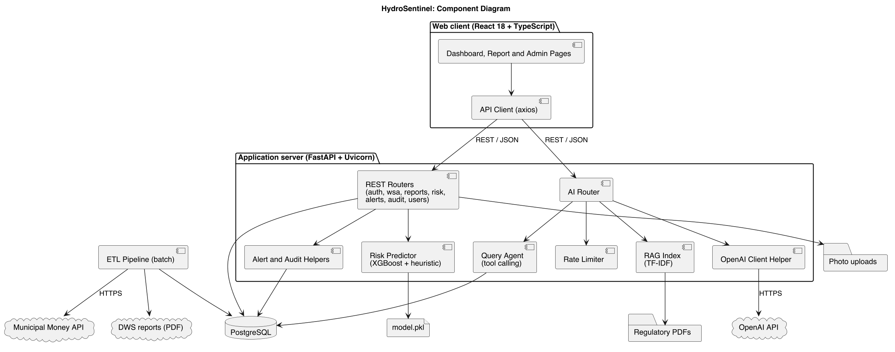

Figure 6 shows the software dependencies. The React pages call one API client, which calls either the REST routers or the AI router. The REST routers depend on the alert and audit helpers, the risk predictor, PostgreSQL and the photo folder. The AI router depends on the rate limiter, the query agent, the retrieval index and the OpenAI client helper. The risk predictor reads `model.pkl`, the retrieval index reads the regulatory PDFs, and the OpenAI client helper is the only component that reaches the OpenAI API. The ETL pipeline is separate: it writes to PostgreSQL and reads the Municipal Money API and the DWS reports.

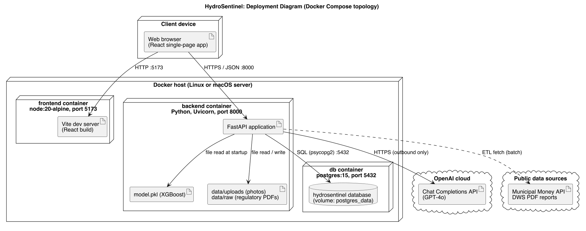

Figure 7 shows where the software runs. The repository's `docker-compose.yml` defines three containers on one Docker host: a `node:20-alpine` container running the Vite server on port 5173, a Python container running FastAPI under Uvicorn on port 8000, and a `postgres:15` container with a named volume. The backend container also holds `model.pkl`, the uploads folder and the regulatory PDFs. A browser on any client device reaches the frontend and the API. The backend calls the OpenAI cloud outbound over HTTPS, and the ETL step reaches the public data sources.

An honest note on verification: the prototype was tested as separate local processes (PostgreSQL 16 on port 5433, Uvicorn on port 8010 and the Vite server on port 5182), not through Docker, because the Docker daemon was not running on the development machine. The Compose file is therefore configured but its full start-up has not been exercised in this evaluation. The frontend container also runs the Vite development server, so a production release would need a built static bundle behind a web server with HTTPS.

### 3.7 Important design decisions

1. **The AI writes text and estimates risk, but never changes a record on its own.** GPT-4o only produces language and structured suggestions. An Admin must click Accept to change a CAP, and every change is audited. This keeps a person accountable for each decision.
2. **The risk model has a deterministic fallback.** If no model is loaded, the WSA has no Blue Drop score, or the model's top probability is under 0.5, the rule-based heuristic scores the WSA instead and the result is labelled with its source. This is why scoring never fails, and it is also why the fallback produced 70% of stored scores (section 5.4).
3. **All OpenAI traffic goes through one helper.** Rate limiting, the missing-key check, the 30 second timeout and error translation (503 or 502) live in one place, so a provider change or an outage touches one file.
4. **The query agent can only call whitelisted database tools.** GPT-4o cannot run free-form SQL or invent figures, because every number in an answer comes from a tool result, and the response shows which tools were used (visible as "Checked: compare_provinces" in Figure 11).
5. **Children are deleted with their parent, but users are never deleted.** Deleting a WSA cascades to its reports, history and alerts, and deleting a user cascades only to that user's refresh tokens. Every other reference to a user uses ON DELETE SET NULL, and the audit log uses RESTRICT, so records and history are never lost when an account is removed.
6. **The audit log is append-only.** Rows are written by one helper and never updated, so the history of who changed what cannot be rewritten through the application.
7. **The rate limiter is in memory.** It needs no extra infrastructure, which suits a prototype, but it does not survive a restart and does not share counts between several server processes. A shared store would replace it in the final product.

---

## Question 4: Implementation Documentation

### 4.1 Technology stack, project structure, modules and interface

**Technology stack.**
- Frontend: React 18.3 with TypeScript 5.8, built with Vite 5, styled with Tailwind CSS 3 and shadcn/ui components, maps with Leaflet 1.9 through react-leaflet 4, HTTP through axios, routing through React Router 6. Tests use Vitest 2 with jsdom.
- Backend: Python with FastAPI 0.115 served by Uvicorn 0.34, SQLAlchemy 2.0 for data access, Pydantic 2 for validation and settings, python-jose for JWTs and bcrypt for password hashing. The Docker image uses Python 3.11 and the development machine ran Python 3.13.
- Database: PostgreSQL (version 15 in the Compose file, version 16 on the development machine).
- AI: XGBoost 2.1 and scikit-learn 1.6 for the risk model and the TF-IDF index, pdfplumber for reading PDFs, and the OpenAI Python SDK 2.40 for GPT-4o.
- Tooling: pytest 8 for the backend, Docker Compose for the container definition, Git for version control.

**Project structure.** The repository has two applications and a documentation folder.
- `backend/main.py`: creates the FastAPI app, registers the eight routers, sets CORS, loads the model at start-up and seeds the admin account.
- `backend/app/`: configuration (`config.py`), database engine (`database.py`), models (`models.py`), request and response schemas (`schemas.py`), authentication (`auth.py`), alert and audit helpers, the rate limiter (`rate_limit.py`) and the `routes/` folder with one file per router.
- `backend/ai/`: the risk predictor (`predict.py`), feature builder (`features.py`), training scripts (`train.py`, `train_from_bdrr.py`), the risk trajectory forecast (`trajectory.py`), the query agent (`query_agent.py`) and the retrieval index (`rag.py`).
- `backend/etl/`: one parser per source (Blue Drop, No Drop, Green Drop, BDRR, Municipal Money), name matching, the loader and `run_etl.py`, which runs them all.
- `backend/data/`: `raw/` holds the source PDFs and `uploads/` holds citizen photos.
- `backend/tests/`: 26 test files.
- `frontend/src/`: `pages/` (four pages), `components/` (map, cards, report form, shared UI), `api/` (one client file per backend area), `lib/` (pure helpers with tests).
- `docs/`: the two assignment documents, diagram sources and screenshots.

**Major modules and their responsibilities.**
- Authentication (`app/auth.py`, `routes/auth.py`): logs users in, issues a short-lived access token and a rotating refresh token, and provides the admin-only dependency that guards protected routes.
- WSA and risk (`routes/wsa.py`, `routes/risk.py`, `ai/predict.py`): lists WSAs, updates CAP status, scores risk, stores risk history and computes the trend forecast.
- Reports (`routes/reports.py`): accepts citizen reports with photos, lets a citizen track a report by reference code, and lets an admin change case status and comment.
- Alerts and audit (`alert_helpers.py`, `audit_helpers.py`, `routes/alerts.py`, `routes/audit.py`): raises the five alert types, deduplicates them, and writes and serves the append-only audit log.
- AI service (`routes/ai.py`, `ai/query_agent.py`, `ai/rag.py`, `rate_limit.py`): summaries, digests, recommendations, CAP drafts, the query agent and regulatory questions, all rate limited and all reaching OpenAI through one helper.
- ETL (`backend/etl/`): turns the source PDFs and the Municipal Money API into WSA rows.
- Frontend pages: the dashboard (map, snapshot, AI insights), the report page, the login page and the admin page (alerts, trending WSAs, AI assistant, citizen reports, CAP table and CAP drafting).

**Selected interface screenshots.**

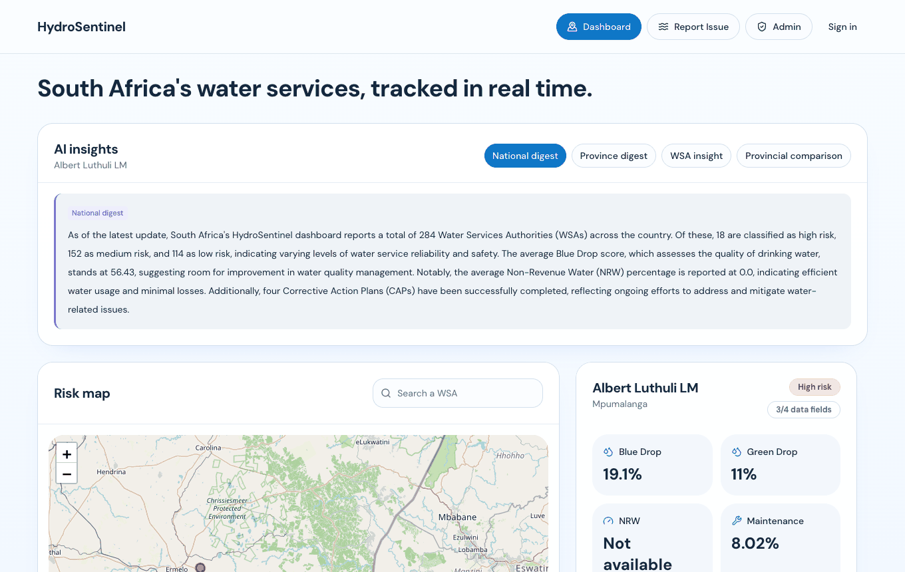

Figure 8: the public dashboard. The AI insights panel shows the cached national digest, the map shows each WSA coloured by risk level, and the card on the right shows the selected WSA's indicators.

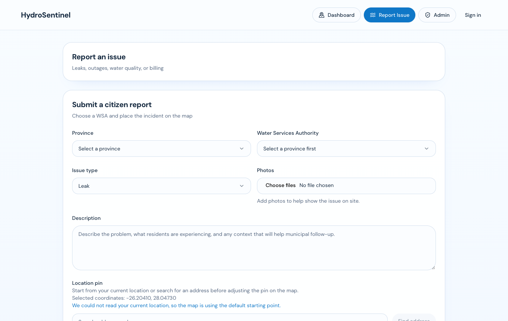

Figure 9: the citizen report page. A citizen chooses a province and WSA, picks an issue type, optionally adds photos, describes the problem and places a pin on the map.

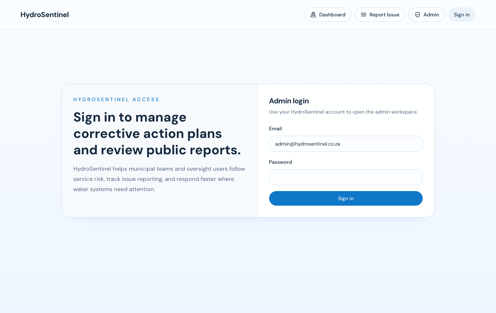

Figure 10: the admin sign-in page. Only accounts with the admin role reach the admin page.

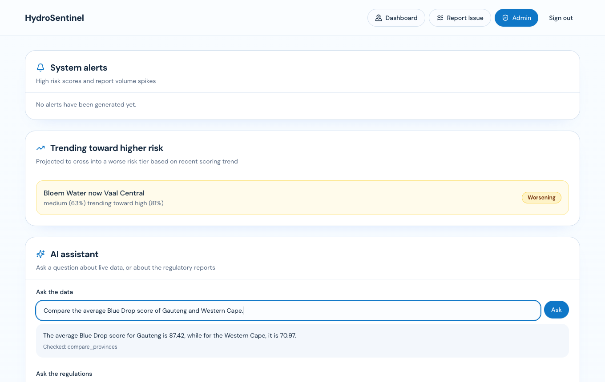

Figure 11: the admin page. The "Trending toward higher risk" panel comes from the forecast in `ai/trajectory.py`. The AI assistant answered a question in plain language and shows which tool it used ("Checked: compare_provinces").

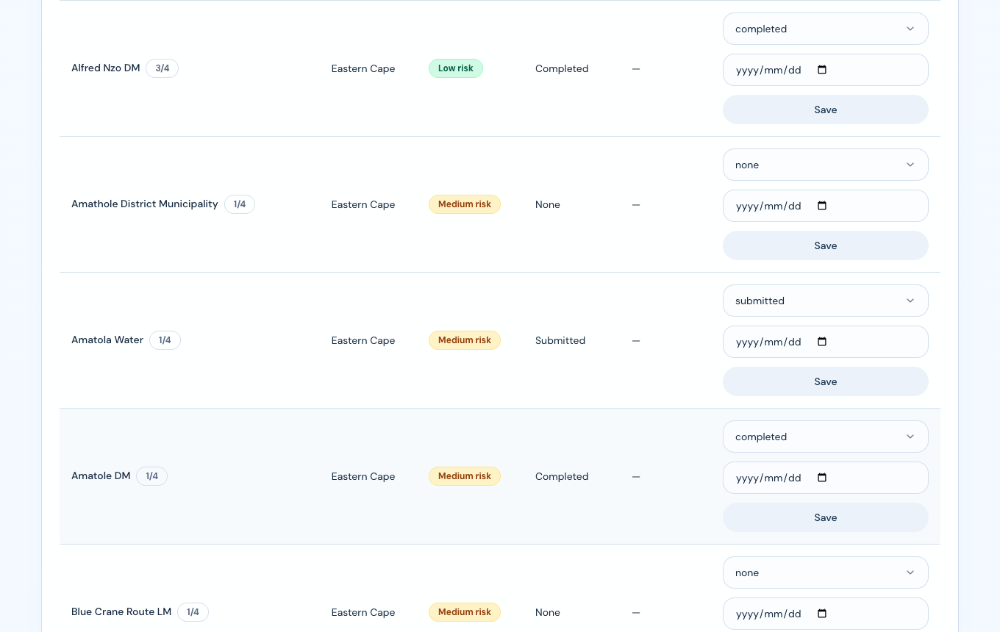

Figure 12: the CAP status table, where an admin sets a WSA's CAP status and due date and saves the change. Each row shows how many of the four data fields the WSA has.

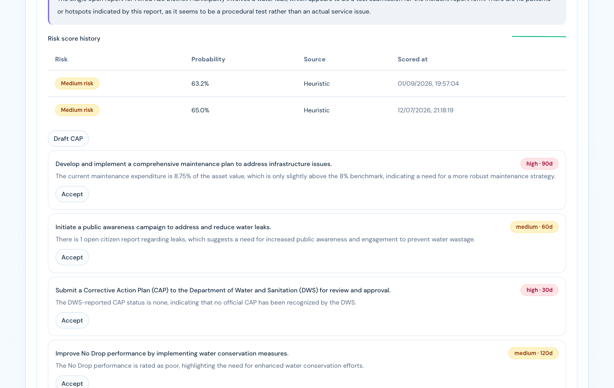

Figure 13: an AI-drafted CAP. Each item shows a priority, a suggested number of days and a justification that quotes the WSA's data. The Admin decides which item to accept.

### 4.2 Database and dataset

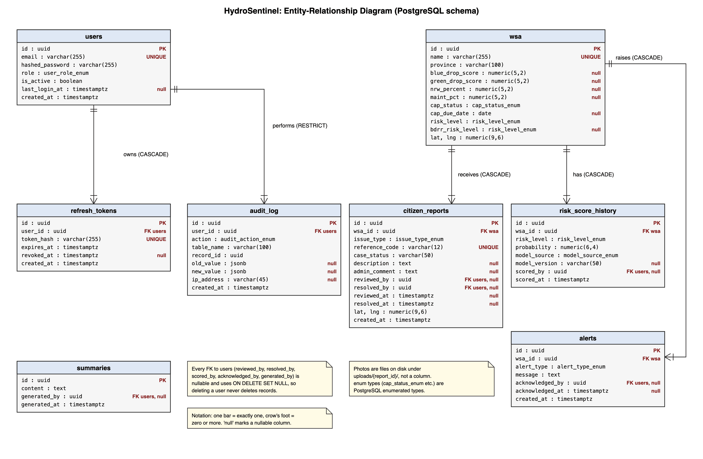

Figure 14 shows the eight tables, their keys and the delete rules. The links from `wsa` and `users` to their children are drawn, and the five nullable references to `users` are marked on the columns.

**Data dictionary.**
- `wsa` (284 rows): one row per Water Service Authority. Columns: `id` (uuid, primary key), `name` (unique), `province`, `blue_drop_score`, `green_drop_score`, `nrw_percent`, `maint_pct` (all nullable numbers), `cap_status` (none, submitted, in_progress or completed), `cap_due_date`, `risk_level` (low, medium or high), `bdrr_risk_level` (the DWS label, nullable), `lat`, `lng`, and further ETL fields such as `dws_cap_status` and `asset_value`.
- `citizen_reports`: one row per issue. Columns: `wsa_id` (foreign key), `issue_type` (leak, outage, quality or billing), `reference_code` (unique, 12 characters, given to the citizen), `case_status` (open, in_review or resolved), `description`, `admin_comment`, `reviewed_by` and `resolved_by` (nullable foreign keys to `users`), `reviewed_at`, `resolved_at`, `lat`, `lng`, `created_at`.
- `risk_score_history` (568 rows): append-only log of scoring runs. Columns: `wsa_id`, `risk_level`, `probability` (0 to 1), `model_source` (xgboost or heuristic), `model_version`, `scored_by`, `scored_at`.
- `alerts`: early warnings. Columns: `wsa_id`, `alert_type` (risk_level_high, risk_level_increased, report_volume_spike, cap_overdue or geo_cluster_incident), `message`, `acknowledged_by`, `acknowledged_at`, `created_at`.
- `users` (3 rows): `email` (unique), `hashed_password`, `role` (admin or viewer), `is_active`, `last_login_at`, `created_at`.
- `refresh_tokens`: `user_id`, `token_hash` (unique), `expires_at`, `revoked_at`.
- `audit_log`: append-only record of admin changes. Columns: `user_id`, `action` (cap_status_updated, report_status_updated, report_comment_updated, risk_score_run, wsa_updated, user_created or summary_generated), `table_name`, `record_id`, `old_value` and `new_value` (JSON), `ip_address`, `created_at`.
- `summaries`: caches the AI national digest for 24 hours. Columns: `content`, `generated_by`, `generated_at`.

**Where the data and the training labels come from.** All data is public government data, and no personal data is used to train or score anything.
- WSA names and Blue Drop scores come from the DWS 2023 Blue Drop report (`blue_drop_2023.pdf`, read by `etl/parse_blue_drop.py`). These audits define the list of 284 WSAs.
- The training labels come from the Blue Drop Risk Rating (BDRR) tables in the same report (`bdn_2023_full.pdf`, an identical copy, read by `etl/parse_bdrr.py`). DWS auditors calculate BDRR independently from five risk indicators (design capacity, operational capacity, water quality compliance, technical capacity and water safety plans), so it is a real audited outcome and not a value the system made up. The report's bands are mapped to three: 70% and above (including "critical") is high, 50% to 69% is medium and below 50% is low. 144 WSAs carry a label: 95 low, 32 medium and 17 high.
- No Drop performance comes from the 2023 No Drop report, and Green Drop scores from the 2023 national and 2025 Gauteng Green Drop reports.
- Maintenance spending as a share of asset value comes from the National Treasury Municipal Money API (audited actuals, benchmark 8%).
- The same PDFs plus `benchmarking_2022.pdf` are indexed for regulatory question answering only.

**What the model actually learns from.** The XGBoost model has six inputs: Blue Drop score, NRW percent, maintenance percent, CAP status code, latitude and longitude. Four facts limit how far it can be trusted.
- `nrw_percent` is empty for all 284 WSAs, because the No Drop parser reads a score and not an NRW percentage. Missing values become zero, so this input is constant and adds no information.
- Blue Drop score is missing for 116 WSAs (41%), so the rule-based fallback scores them. That is why the fallback produced 400 of 568 stored scores.
- 46% of WSAs share a coordinate with three or more others, because the PDFs carry no GPS positions and the loader uses a province centroid. Latitude and longitude therefore act partly as a province code.
- The BDRR label and the Blue Drop score come from the same DWS audit, so they are correlated. The model estimates one DWS rating from related DWS data.

The deployed file `backend/ai/model.pkl` (1 September 2026) was trained by `ai/train_from_bdrr.py` on the 144 labelled rows.

**Validation rules.**
- Report intake: the WSA must exist (404), `issue_type` must be one of four values (422), and latitude and longitude must be numbers. Only files with an image extension (.jpg, .jpeg, .png, .webp, .gif) are stored. The form also requires a province, a WSA and a description of at least 10 characters.
- Case updates accept only open, in_review or resolved, with a comment of at most 2,000 characters. Passwords need at least 8 characters, emails must be valid and a duplicate email returns 409. AI questions must be 3 to 500 characters.
- CAP drafts: the model's reply is parsed and checked. Invalid JSON gives an empty result, a bad priority becomes medium, an item without an action is dropped, and at most six items are kept.
- Not enforced on the server: a maximum description length, coordinate ranges, and photo number or size. Only the form limits these (section 5.4).

**Privacy controls.**
- Citizens need no account. A report holds only what they type and a map pin, and the public tracking endpoint returns the status with no personal details (a test confirms this).
- Passwords are stored as bcrypt hashes. Refresh tokens are stored as SHA-256 hashes, are single use and are revoked at logout. Access tokens last 60 minutes and refresh tokens 7 days.
- Admin endpoints reject calls without a valid admin token. Photos sit under a random report id folder, not in the database. The audit log records the actor and the old and new values. CORS allows only the configured frontend address and the local development address.

**Backup approach.** The database is the only store that cannot be rebuilt by re-running a script, because it holds citizen reports, admin decisions, alerts and the audit trail. The plan is a nightly `pg_dump` kept for 30 days on a separate host, plus a copy of `data/uploads/`. The WSA data, model file and retrieval index can be rebuilt from the PDFs and the training script. No backup job exists in the repository yet, so this is a task for the final product.

### 4.3 API and integration interface

The backend serves a JSON REST API. Interactive documentation is generated automatically at `/docs` on the running server. All errors use the same shape, a JSON body with a `detail` message. The common status codes are 401 for a missing or invalid token, 403 for a valid token without the admin role or for an inactive account, 404 for an unknown record, 409 for a duplicate, 422 for a body that fails validation, 429 for the AI rate limit, 502 when the AI call fails or returns nothing usable, and 503 when the OpenAI key is not configured.

**Authentication endpoints.**
- `POST /auth/login`. Input: email and password. Output: an access token, a refresh token and the user. Authentication: none. Errors: 401 for a wrong password, 403 for an inactive user.
- `POST /auth/refresh`. Input: a refresh token. Output: a new access token and refresh token. The old refresh token cannot be used again. Errors: 401 for an unknown, used, revoked or expired token.
- `POST /auth/logout`. Input: the refresh token to revoke. Output: no content.
- `GET /auth/me`. Authentication: access token. Output: the signed-in user.

**Public endpoints (no token).**
- `GET /wsa` and `GET /risk/scores`. Output: the list of WSAs with indicators, risk level and CAP status, and the current risk scores.
- `POST /reports`. Input: multipart form with `wsa_id`, `issue_type`, `description`, `lat`, `lng` and optional `photos`. Output: 201 with the report and its reference code. Errors: 404 for an unknown WSA, 422 for an invalid field.
- `GET /reports/track/{reference_code}`. Output: status and timestamps only, with no personal data. Errors: 404 for an unknown code.

**Admin endpoints (admin access token required).**
- `PATCH /wsa/{id}`. Input: a CAP status and optional due date. Output: the updated WSA. Effect: writes an audit entry. Errors: 404.
- `PATCH /reports/{id}`. Input: `case_status` and an optional comment. Output: the updated report. Effect: sets `reviewed_by` or `resolved_by` and writes an audit entry. Errors: 404, 422.
- `POST /risk/score/{wsa_id}`. Output: risk level, probability and model source. Effect: updates the WSA, stores a history row, writes an audit entry and may raise a high-risk alert. Errors: 404.
- `GET /alerts` and `PATCH /alerts/{id}/acknowledge`. Output: the alerts, and the acknowledged alert (calling it twice is safe). Errors: 404.
- `GET /audit-log`. Output: the audit entries, filterable by record.
- `GET /reports`, `GET /reports/export.csv`, `GET /wsa/export.csv`. Output: reports as JSON, and CSV files.
- `GET /risk/history/{wsa_id}`, `GET /risk/trajectory/{wsa_id}` and `GET /risk/trending`. Output: the score history and the forecast.
- `POST /users`, `GET /users` and `PATCH /users/{id}`. Create, list and deactivate admin users. Errors: 409 for a duplicate email.

**AI endpoints.**
- `GET /ai/wsa/{id}/cap-draft` (admin token, rate limited). Output: 3 to 5 structured items, at most 6 after validation. Errors: 404, 429, 502, 503.
- `POST /ai/query` (admin token, rate limited). Input: `{"question": "..."}` of 3 to 500 characters. Output: the answer and the list of tools used. Errors: 422, 429, 503.
- `GET /ai/regulatory-context?query=...` (admin token, rate limited). Output: an answer with the source PDF named. Errors: 404 when nothing is indexed, 429.
- Recommendations, report summary and report comment under `/ai/` also need an admin token, but are not rate limited.
- Six AI text endpoints are public, need no token and are not rate limited: the WSA summary, risk explanation, comparison and report context, the province digest and the national digest. The national digest is cached for 24 hours, and the others call OpenAI on every request. Section 5.4 records this as an open cost risk.

**External integrations.**
- OpenAI Chat Completions, called outbound over HTTPS with the key from the environment, a 30 second timeout and one retry. It is used by the summary, digest, comment, CAP draft and query functions.
- National Treasury Municipal Money API, called only by the ETL step.

### 4.4 Installation, configuration and deployment

**Minimum hardware and software.**
- Server: 2 CPU cores at 2.0 GHz, 4 GB of memory, 20 GB of SSD storage and a stable outbound internet connection for OpenAI. The recommended server is 4 cores, 8 GB of memory and 50 GB of SSD.
- Software: Docker with Docker Compose for the container route, or, for a local run without Docker, Python 3.11 or later, Node.js 20 or later and PostgreSQL 15 or later.
- Client: any device with a current version of Chrome, Safari, Firefox or Edge. Admin use is best on a screen of at least 1280 by 720.

**Installation and configuration.**
1. Get the source: clone the repository.
2. Copy `.env.example` to `.env` in the repository root. Set `POSTGRES_PASSWORD` and the matching `DATABASE_URL`, set `JWT_SECRET_KEY` to a long random value, set `ADMIN_EMAIL` and `ADMIN_PASSWORD` for the first admin account, and set `OPENAI_API_KEY`. Leave the OpenAI key blank to run without the AI functions. Set `FRONTEND_URL` to the exact address the browser uses, because the API only accepts requests from that origin.
3. Put the source PDFs in `backend/data/raw/`.

**Run with Docker.**
1. In the repository root run `docker compose up --build`.
2. The database starts first, then the backend on port 8000 and the frontend on port 5173.
3. Open `http://localhost:5173`. The backend creates the tables and seeds the admin account on start-up.

**Run without Docker.**
1. Create a database and user in PostgreSQL that match `DATABASE_URL`.
2. In `backend/`, create a virtual environment, install `requirements.txt` and start the server with `uvicorn main:app --port 8000`.
3. In `frontend/`, run `npm install`, then `npm run dev`. Set `VITE_API_URL` to the backend address.

**Load the data.** In `backend/` run the ETL step (`python -m etl.run_etl` with `PYTHONPATH` set to the backend folder). It reads `data/raw/` and upserts the WSA rows. Then, with the backend running, run `scripts/bulk_risk_score.py` (it needs `API_URL`, `ADMIN_EMAIL` and `ADMIN_PASSWORD` in the environment) so that every WSA gets a risk score and a history row. This script is the only place scoring is run in bulk, and it must be repeated after each data load. To re-evaluate or retrain the model, run `ai/train_from_bdrr.py`. Adding `--deploy` retrains on every labelled row and overwrites `ai/model.pkl`. Without that flag it only prints the evaluation.

**Run the tests.** In `backend/` run `pytest tests/`. In `frontend/` run `npm test`. The backend tests use the database in `DATABASE_URL` inside a transaction that is rolled back after each test.

**Before a real deployment.** Replace every example secret, serve the site over HTTPS behind a reverse proxy, build the frontend as static files instead of running the Vite development server, restrict the database port to the backend host, and add the backup job from section 4.2.

---

## Question 5: Evaluation and Responsible Use

### 5.1 Test summary

**Test environment.** All results below were produced on 19 September 2026 on the development machine: PostgreSQL 16 on port 5433 holding the real dataset (284 WSAs), the FastAPI server under Uvicorn on port 8010, the Vite development server on port 5182, Python 3.13, Node 20 and Chrome. The live OpenAI key for the project was used for the AI checks. The automated backend tests run against the same database inside a transaction that is rolled back after each test, so they leave no data behind.

**Overall results.** The backend suite ran 173 tests and all passed (pytest, about 33 seconds). The frontend suite ran 13 Vitest tests in three files and all passed, and the TypeScript compiler (`tsc --noEmit`) reported no errors. The 173 backend tests sit in 26 files, and the largest groups are the query agent (14), retrieval (14), the CAP draft (11), the risk history (7), alerts (10) and users (9).

**Unit tests.** They check single functions with no network. Examples are the risk predictor's choice between model and fallback, CAP-draft JSON parsing, the distance calculation for geographic clusters, the PDF parsers and name matching in the ETL, the trend forecast, and the frontend helpers that pick the default WSA, filter reports by date and score how complete a WSA's data is.

**Integration tests.** They call the real endpoints through FastAPI's test client against the real database schema. They cover login and token rotation, report intake and tracking, case status changes, CAP updates with audit entries, risk scoring and history, alert creation and deduplication, user management, CSV export, the CAP draft, query and regulatory endpoints with the OpenAI call replaced by a stand-in, and the rate limiter.

**System tests.** They were run by hand against the running servers with the measurement scripts and the live OpenAI key. They are defined in the representative tests below (ST-01 to ST-06).

**User acceptance tests.** They were scripted walkthroughs of the main workflow in Chrome, carried out by the developer and not by external users (UAT-01 to UAT-03). Testing with real citizens and administrators has not been done and is planned before the final product.

**Representative tests.**

Test case: TC-U1, risk predictor falls back on low confidence (unit, `tests/test_predict.py`)  
Expected result: when the model's top probability is under 0.5 the heuristic result is returned with source "heuristic".  
Actual result: the heuristic result was returned.  
Status: Pass  
Evidence: pytest run of 19 September 2026, 173 passed.

Test case: TC-U2, malformed CAP draft is handled (unit, `tests/test_cap_draft.py`)  
Expected result: invalid JSON gives an empty list, a bad priority becomes medium, and no more than six items are returned.  
Actual result: as expected in all three tests.  
Status: Pass  
Evidence: the same pytest run.

Test case: TC-U3, distance for cluster detection (unit, `tests/test_geo_cluster_alert.py`)  
Expected result: Johannesburg to Pretoria measures between 50 and 60 km.  
Actual result: within that range.  
Status: Pass  
Evidence: the same pytest run.

Test case: TC-U4, frontend default WSA (unit, `frontend/src/lib/wsaSelection.test.ts`)  
Expected result: the default WSA is the highest-risk one, not the first name alphabetically.  
Actual result: as expected. This test guards a real bug found earlier, where a WSA named "!Kai! Garib LM" always won.  
Status: Pass  
Evidence: Vitest run, 13 tests passed.

Test case: TC-I1, public tracking hides personal data (integration, `tests/test_report_tracking.py`)  
Expected result: the tracking response contains the status and no personal fields.  
Actual result: no personal fields present.  
Status: Pass  
Evidence: the pytest run.

Test case: TC-I3, CAP change is audited (integration, `tests/test_audit_log.py`)  
Expected result: changing a WSA's CAP status writes an audit entry naming the actor.  
Actual result: the entry was written with the actor's id.  
Status: Pass  
Evidence: the pytest run.

Test case: TC-I8, geographic cluster and volume alerts (integration, `tests/test_geo_cluster_alert.py` and `tests/test_alerts.py`)  
Expected result: three same-type reports within 2 km inside 6 hours raise a geo cluster alert, and two do not. Five reports in 24 hours raise a volume alert, and four do not.  
Actual result: as expected in all four cases.  
Status: Pass  
Evidence: the pytest run. The two volume-alert tests were added during this evaluation.

Test case: TC-I9, refresh token is single use (integration, `tests/test_auth.py`)  
Expected result: a refresh token works once and a second use is rejected.  
Actual result: the second use returned 401.  
Status: Pass  
Evidence: the pytest run.

Test case: TC-I10, AI rate limit and timeout (integration, `tests/test_ai_rate_limit.py`)  
Expected result: the 21st request in an hour returns 429, other users are not affected, and the OpenAI client has a 30 second timeout and one retry.  
Actual result: as expected. The timeout test failed first, exposing that the client used the library default of 600 seconds, and passed after the fix.  
Status: Pass  
Evidence: the pytest run.

Test case: ST-01, list response time (system, NFR-01)  
Expected result: `GET /wsa` answers within 3 seconds at the 95th percentile.  
Actual result: 100 sequential requests had a median of 8 ms and a 95th percentile of 9 ms. With 50 concurrent users sending four requests each (200 requests), the median was 413 ms, the 95th percentile 474 ms and the slowest 507 ms. The response held 284 WSAs and about 175 KB.  
Status: Pass  
Evidence: the measurement script output.

Test case: ST-02, core functions with the AI unavailable (system, NFR-02)  
Expected result: with no OpenAI key, AI endpoints fail cleanly and core endpoints keep working.  
Actual result: a second server started with a blank key returned 503 "OPENAI_API_KEY is not configured" from the WSA summary and CAP draft endpoints in 2 to 3 ms, and returned 200 from `/wsa`, `/alerts` and `/risk/scores`. The national digest returned 200 from its 24 hour cache.  
Status: Pass  
Evidence: the measurement script output.

Test case: ST-03, protected endpoints reject anonymous calls (system, NFR-04)  
Expected result: admin endpoints return 401 without a token.  
Actual result: `GET /audit-log`, `GET /alerts`, `POST /risk/score/{id}`, `GET /reports`, `GET /users` and `PATCH /wsa/{id}` all returned 401.  
Status: Pass  
Evidence: the measurement script output.

Test case: ST-04, AI summary quality (system, FR-05)  
Expected result: a summary in under 8 seconds that uses the WSA's real scores.  
Actual result: three WSAs answered in 2.13, 1.55 and 1.80 seconds, and each summary quoted the WSA's actual Blue Drop score.  
Status: Pass  
Evidence: the measurement script output.

Test case: ST-05, CAP draft (system, FR-06)  
Expected result: at least one structured item per WSA, generated in a reasonable time.  
Actual result: three WSAs gave 5, 4 and 5 items in 2.79, 2.53 and 3.25 seconds, each with a priority and a due date in days.  
Status: Pass  
Evidence: the measurement script output and Figure 13.

Test case: ST-06, natural-language query (system, FR-08, AI-NFR-02)  
Expected result: a correct answer computed from the database, within 15 seconds and five round-trips.  
Actual result: three questions returned in 3.43, 1.77 and 2.25 seconds with one tool call each. The comparison answer (Gauteng 87.42, Western Cape 70.97) matched the database averages.  
Status: Pass  
Evidence: the measurement script output and Figure 11.

Test case: UAT-01, citizen report page (acceptance, NFR-03)  
Expected result: a citizen can reach the form without an account, and only a few fields are required.  
Actual result: the page opens without signing in, and submit needs only province, WSA and a description of at least 10 characters.  
Status: Pass  
Evidence: Figure 9 and the form's submit rule in `ReportForm.tsx`.

Test case: UAT-02, admin drafts and accepts a CAP item (acceptance, FR-06 and FR-07)  
Expected result: after signing in, the Admin can draft a CAP and accept an item, and the CAP status updates.  
Actual result: on 16 September 2026 an Accept click showed "CAP updated for Alfred Nzo District Municipality" and the browser console had no errors. On 19 September 2026 a Draft CAP click showed four CAP items with Accept buttons.  
Status: Pass  
Evidence: Figure 13.

Test case: UAT-03, public dashboard loads (acceptance)  
Expected result: the dashboard shows the digest, map and a default WSA card.  
Actual result: it loaded with the digest, the map and the default WSA card.  
Status: Pass, with a content problem noted in section 5.4  
Evidence: Figure 8.

**Defects found and fixed during testing.**
- The OpenAI client had no explicit timeout. The library default is 600 seconds with two retries, so an OpenAI outage could hold an admin request for many minutes. It now uses 30 seconds and one retry, with a test.
- The report-volume alert had no automated test. Two tests now pin its threshold at exactly five reports.
- One test assumed the shared database had no audit rows and failed once a real row existed. It now compares against a baseline.
- `.env.example` told developers to set `ANTHROPIC_API_KEY`, but the code reads `OPENAI_API_KEY`, so a developer following it would get 503 responses. It now names the right variable.
- Four requirement statements did not match the code and were corrected (section 1.2).

### 5.2 Quantitative evaluation

**Non-functional requirement 1, performance (NFR-01).** The target was a 95th percentile of 3 seconds or less for the WSA list under normal load of up to 50 concurrent admin users. The measured 95th percentile was 9 ms for one user and 474 ms for 50 concurrent users, about six times faster than the target. The result comes from one Uvicorn process on a laptop, with the test client and the server on the same machine, so it shows there is room to spare and is not a capacity forecast. The response is about 175 KB, and it will grow with more WSAs.

**Non-functional requirement 2, reliability when the AI is unavailable (NFR-02).** The target was that reporting, CAP tracking and the dashboard keep working without OpenAI. With the key blank, AI endpoints answered 503 in 2 to 3 ms and the three core endpoints tested answered 200. The remaining gap is a failure inside OpenAI, not a missing key: that returns 502 and, since this evaluation, is cut off after 30 seconds and one retry instead of ten minutes.

**Non-functional requirement 3, security (NFR-04).** Six admin endpoints were called without a token and all returned 401. Eleven automated tests check that admin-only endpoints refuse callers who are not signed in as an admin. The public AI endpoints are outside NFR-04 as written and are discussed in section 5.4.

**Emerging-technology metric, model accuracy (AI-NFR-01).** Measured with `ai/train_from_bdrr.py` against the 144 DWS-audited BDRR labels. The XGBoost model reached 89.7% accuracy on the single held-out split of 29 WSAs, against 34.5% for the rule-based heuristic. Five-fold cross-validation gave a mean of 77.8% with a standard deviation of 8.8%, with folds from 65.5% to 86.2%. Per class on the held-out split: high precision 1.00 and recall 1.00 (3 WSAs), low precision 0.86 and recall 1.00 (19 WSAs), medium precision 1.00 and recall 0.57 (7 WSAs). The model is clearly better than the heuristic it replaces, but the cross-validated figure is under the 80% target and the medium class is the weak point.

**Emerging-technology metric, query latency (AI-NFR-02).** Three live questions answered in 1.77 to 3.43 seconds, against a 15 second target.

### 5.3 User guide for the main workflow

The main workflow runs from a resident's report to an accepted corrective action plan item.

**Step 1: a citizen reports a problem.** Open the report page (Figure 9). Choose the province and the WSA, pick the issue type, add photos if you have them, describe what is happening in at least 10 characters, and move the map pin to the place. Submit. The page returns a reference code. Keep it: entering it on the tracking page shows the status of the report without any personal details.

**Step 2: an admin signs in.** Open the sign-in page (Figure 10) and enter the admin email and password. The admin page opens (Figure 11). Signing out is at the top right.

**Step 3: review alerts and trends.** At the top of the admin page, "System alerts" lists warnings such as a high risk score, a volume spike or a geographic cluster, and "Trending toward higher risk" lists WSAs whose recent scores are heading into a worse tier. Acknowledge an alert once it has been dealt with.

**Step 4: triage citizen reports.** In "Citizen reports", filter by province, WSA and date. Open a report, set its case status to open, in review or resolved, write an admin comment (the "Generate AI comment" button drafts one for you to edit), and save.

**Step 5: keep risk scores current.** The risk shown on the map and in the tables is the last stored score. Scoring is not automatic and there is no scoring button, so after loading new data run `scripts/bulk_risk_score.py`, or call `POST /risk/score/{wsa_id}` for one WSA.

**Step 6: use the AI assistant.** Under "AI assistant", type a question about live data in "Ask the data", for example "Compare the average Blue Drop score of Gauteng and Western Cape", and press Ask. The answer appears with the tool that was used (Figure 11). Use "Ask the regulations" for questions about the DWS reports. Each admin can make 20 AI requests per hour.

**Step 7: draft and accept a CAP.** In the CAP section choose a WSA and click Draft CAP. Read each item, its priority and its justification (Figure 13). Click Accept on an item to set the WSA's CAP status to submitted with the suggested due date. You can also set the CAP status and due date yourself in the CAP table (Figure 12) and click Save.

**Troubleshooting.**
- "Unable to load admin data" or "Unable to load WSA data": the page cannot reach the API. Check that the backend is running, that `VITE_API_URL` points to it, and that `FRONTEND_URL` on the server matches the exact address in the browser bar, including `localhost` versus `127.0.0.1`, because the server only accepts that origin.
- Sign-in fails with 401: the email or password is wrong. A 403 means the account has been deactivated.
- An AI button returns 503: the server has no OpenAI key. Add `OPENAI_API_KEY` to `.env` and restart the backend. Everything else works without it.
- An AI button returns 429: this admin has used 20 AI requests in the last hour. Wait, and the oldest calls drop out of the window.
- A CAP draft returns 502: OpenAI failed or returned nothing usable. Try again. If it keeps failing, check the OpenAI account and network.
- The dashboard shows no digest: the digest is generated once every 24 hours and needs the OpenAI key. It will appear on the next successful call.
- The map shows no WSAs: the ETL step has not been run. Run it, then run the bulk scoring script.
- Risk levels look out of date: run the bulk scoring script (Step 5).
- The backend test suite hangs: the database is not running or `DATABASE_URL` is wrong. Start PostgreSQL and check the connection string.

### 5.4 Limitations, risks, ethics, maintenance and future work

**Current limitations.**
- The model learns from only 144 labelled WSAs (17 high, 32 medium). Its cross-validated accuracy of 77.8% is under the 80% target and medium risk is recalled poorly (0.57).
- Its inputs are weaker than they look (section 4.2): `nrw_percent` is constant, Blue Drop score is missing for 41% of WSAs, and 46% of coordinates are province centroids. The fallback produced 70% of stored scores (400 of 568) and scored only 34.5% on the test rows, so for WSAs without a Blue Drop score the displayed risk is a weak estimate.
- Risk scoring is manual and has no button, so the aim of a continuously updated view is only partly met.
- The AI digest can state something wrong. The dashboard digest in Figure 8 says average NRW is 0.0 "indicating efficient water usage", when NRW data is missing for every WSA. The digest passes a number that means "no data" and the model reads it as a result.
- No testing with real users has been done, the Docker start-up was not run in this evaluation, and no automated test covers the Accept button or the AI summary endpoint. The Docker image uses Python 3.11 against 3.13 in development, and the frontend container runs the Vite development server.

**Unresolved risks.**
- Six public AI text endpoints need no sign-in and have no rate limit, and five of them call OpenAI on every request, so anyone could run up the bill. Before public release they need sign-in, caching or a per-IP limit.
- The rate limiter keeps its counts in one process's memory, so a restart clears them and two server processes would each allow 20.
- Server-side input limits are thin: a direct API call can send a very long description, invalid coordinates or many large photos.
- The example configuration and test setup contain a database password and the default admin password `admin123`. They should be replaced and the committed values treated as exposed.
- No backup job exists, so losing the database would lose reports, decisions and the audit trail.

**Ethical and security concerns.**
- The AI can be wrong and sound sure. CAP drafts are suggestions, every accepted change is audited, and the evidence is shown beside each item, but a busy admin could still accept a poor one. The final product should record which items were AI-drafted.
- A risk label on a named municipality has consequences. It should be presented as an estimate with its source (model or fallback) and its data completeness, not as an audit finding.
- The data is public and citizens type only what they choose, so privacy exposure is low. Three helpers (report comment, reports summary and report context) send citizens' free text to OpenAI, and the report context endpoint is public, so this needs a data-protection review before release.
- The dependency audit reports a critical issue in Vitest 2, reachable only through its optional `--ui` server, which the project never starts. It is a development dependency and does not ship.

**Maintenance needs.** After each new DWS report cycle, re-run the ETL and bulk scoring, and retrain the model with `ai/train_from_bdrr.py` once new labelled data exists. Keep the regulatory PDFs current in `data/raw/` (the index rebuilds itself when the folder changes). Update dependencies and re-run both test suites, watch OpenAI model and pricing changes, rotate secrets, and track the share of scores that come from the fallback so drift shows early.

**Two realistic future improvements.**
1. Improve the model and its data after the prototype presentation: fix the NRW extraction, replace province-centroid coordinates with real ones, add earlier DWS report years and other public data where the licence allows, and retrain with cross-validation. Aim for cross-validated accuracy above 80% and medium-class recall above 0.7, and show data completeness beside each score.
2. Prepare for public release in the final product: automate scoring when data or reports arrive, add rate limiting and caching to the public AI endpoints, move the limiter to a shared store, serve a built frontend over HTTPS, add an automated nightly backup, and run acceptance testing with real citizens and administrators.
